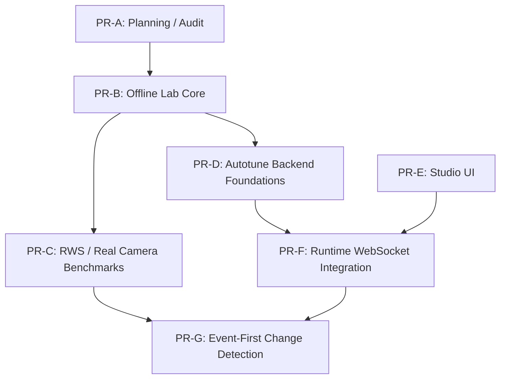

# STAGE6 BRANCH SPLIT PLAN — 2026-06-05

## Executive Summary

Monolityczny branch `task/cv-stage-6-rws-expansion-benchmark-001` integruje 32 logiczne zadania (243 pliki, ponad 31 tysięcy linii kodu i dokumentacji). Z uwagi na jego rozmiar, bezpośrednie scalenie do `master` niesie ryzyko niestabilności i utrudnia rollback.

Niniejszy dokument przedstawia precyzyjny plan podziału (Split Plan) monolitu na **7 mniejszych, kontrolowanych PR**, uporządkowanych według zależności i poziomu ryzyka (od całkowicie bezpiecznych zmian offline do krytycznych modyfikacji runtime).

---

## Source Branch

* **Branch:** `task/cv-stage-6-rws-expansion-benchmark-001`
* **Base Commit:** `b8ce38507bd75d627ed988e7f615944669cad8d5`
* **Head Commit:** `385bd83a8b417df8bdeee15ab07fcfab9a27c0f0`

---

## Inputs Reviewed

1. [.ai/reports/BRANCH_AUDIT_STAGE6_2026_06_05.md](.ai/reports/BRANCH_AUDIT_STAGE6_2026_06_05.md) (raport z audytu brancha).
2. [.ai/TASKS_INDEX.md](.ai/TASKS_INDEX.md) (rejestr zadań).
3. Pliki szczegółów zadań w [.ai/tasks/](.ai/tasks/).
4. Historia commitów i statystyki zmian git (`git log`, `git diff`).

---

## Branch Statistics

* **Zmodyfikowane pliki:** 243
* **Dodane/zmienione linie:** ~31 276
* **Testy jednostkowe:** 433 (status: **PASS**)

---

## Split Strategy Assessment

### Strategy A — Cherry-pick by commit
Prace nad poszczególnymi zadaniami (zwłaszcza autotuning i change detection) były realizowane równolegle i przeplatały się w commitach. Próba cherry-pickingu doprowadzi do licznych konfliktów w `main.py`, `snapshot_first.py` i `studioConsole.js`.
* *Werdykt:* Niezalecana (zbyt wysokie ryzyko konfliktów).

### Strategy B — Rebuild by file paths
Założenie nowych, czystych gałęzi od `master` i kopiowanie gotowych plików z brancha monolitycznego. Eliminuje to historię konfliktów git i gwarantuje scalenie ostatecznej, przetestowanej wersji kodu.
* *Werdykt:* Rekomendowana dla kodu produkcyjnego i laboratoryjnego.

### Strategy C — Hybrid
Cherry-pick dla czystych commitów planistycznych/dokumentacyjnych (np. raportów w `.ai/reports/`), a rekonstrukcja po ścieżkach plików dla całego kodu źródłowego i testów.
* *Werdykt:* **Najlepsza metoda.** Gwarantuje czysty git flow i zero konfliktów scalania.

---

## Recommended Strategy

**Strategy C — Hybrid.** Pliki koncepcyjne i raporty zostaną przeniesione bezpośrednio, natomiast cały kod produkcyjny, testowy i narzędziowy zostanie odtworzony na nowych gałęziach poprzez selektywne kopiowanie plików z monolitu.

---

## Proposed PR Sequence

Poniższa tabela przedstawia planowaną kolejność wdrożenia (PR-A do PR-G):

| PR Order | Name | Goal | Files Included | Risk | Runtime Impact | Requires Live Camera |
| :--- | :--- | :--- | :--- | :--- | :--- | :--- |
| **PR-A** | Planning / Audit Reports | Zapisanie raportów w master. | `.ai/reports/*` | **LOW** | NO | NO |
| **PR-B** | Offline Lab Core | Wdrożenie skryptów laboratoryjnych i testów Stages 1-6. | `tools/cv_detection_lab/*` (bez wizardów i RWS), `app_cv/tests/test_cv_detection_lab_stage1_to_5.py` | **LOW** | NO | NO |
| **PR-C** | RWS / Real Camera Benchmarks | Wdrożenie benchmarków fizycznych, wizardów i bramki jakościowej. | `tools/cv_detection_lab/stage6_real_camera_*.py`, `tools/cv_detection_lab/stage6_rws_expansion_benchmark.py`, `stage6_*.bat`, testy RWS i bramki jakości | **LOW** | NO | NO |
| **PR-D** | Autotune Backend Foundations | Wdrożenie klas scoringu, sesji autotuningu i profili bez zmian w main.py. | `app_cv/tarotvision/autotune_*.py`, `app_cv/tarotvision/profile_store.py`, `app_cv/tests/test_autotune_*.py` | **MEDIUM** | NO | NO |
| **PR-E** | Studio UI | Wdrożenie frontendu operatorskiego w Studio Console. | `app_ar/src/studio/studioConsole.js`, `app_ar/studio.css` | **MEDIUM** | YES (Frontend) | NO (Smoke test w przeglądarce) |
| **PR-F** | Runtime WebSocket & Autotune | Integracja API WebSocket z autotuningiem i explainability. | `app_cv/main.py` (WebSocket part), `app_cv/tarotvision/tuning_protocol.py`, `app_cv/tarotvision/operator_explainability.py`, testy integracji | **HIGH** | YES | **YES** |
| **PR-G** | Event-First Change Detection | Model pustej maty i detekcja zmian w snapshot-first. | `app_cv/tarotvision/change_detection.py`, `app_cv/tarotvision/background_model.py`, `app_cv/tarotvision/pipelines/snapshot_first.py`, testy snapshot_first | **HIGH** | YES | **YES (Rygorystyczny)** |

---

## Dependency Graph



---

## File Ownership Matrix

Precyzyjna alokacja plików do poszczególnych PR:

* **PR-A:**
  - `.ai/reports/BRANCH_AUDIT_STAGE6_2026_06_05.md`
  - `.ai/reports/STAGE6_BRANCH_SPLIT_PLAN_2026_06_05.md`
* **PR-B:**
  - `tools/cv_detection_lab/card_localization_methods.py`
  - `tools/cv_detection_lab/crop_deskew_methods.py`
  - `tools/cv_detection_lab/crop_quality_methods.py`
  - `tools/cv_detection_lab/methods.py`
  - `tools/cv_detection_lab/region_methods.py`
  - `tools/cv_detection_lab/stage1_diff_benchmark.py`
  - `tools/cv_detection_lab/stage2_region_benchmark.py`
  - `tools/cv_detection_lab/stage3_card_localization_benchmark.py`
  - `tools/cv_detection_lab/stage4_crop_deskew_normalize_benchmark.py`
  - `tools/cv_detection_lab/stage5_crop_quality_validation_benchmark.py`
  - `tools/cv_detection_lab/stage6_card_identification_benchmark.py`
  - `tools/cv_detection_lab/stage6_identification_methods.py`
  - `tools/cv_detection_lab/stage6_synthetic_dataset.py`
  - `tools/cv_detection_lab/stage6_synthetic_validation_benchmark.py`
  - `app_cv/tests/test_cv_detection_lab_stage1.py` do `test_cv_detection_lab_stage6_synthetic_validation.py`
* **PR-C:**
  - `tools/cv_detection_lab/stage6_real_camera_*.py`
  - `tools/cv_detection_lab/stage6_rws_expansion_benchmark.py`
  - `stage6_*.bat`
  - `app_cv/tests/test_cv_detection_lab_stage6_real_camera_*.py`
  - `app_cv/tests/test_cv_detection_lab_stage6_rws_expansion_benchmark.py`
* **PR-D:**
  - `app_cv/tarotvision/autotune_profiles.py`
  - `app_cv/tarotvision/autotune_scoring.py`
  - `app_cv/tarotvision/autotune_session.py`
  - `app_cv/tarotvision/autotune_session_log.py`
  - `app_cv/tarotvision/profile_store.py`
  - `app_cv/tests/test_autotune_*.py`
  - `app_cv/tests/test_profile_store.py`
* **PR-E:**
  - `app_ar/src/studio/studioConsole.js`
  - `app_ar/studio.css`
* **PR-F:**
  - `app_cv/main.py` (część WebSocket i orkiestracja autotuningu)
  - `app_cv/tarotvision/tuning_protocol.py`
  - `app_cv/tarotvision/operator_explainability.py`
  - `app_cv/tarotvision/live_fixture_capture.py`
  - `app_cv/tarotvision/card_candidate_validation.py`
  - `app_cv/tarotvision/snapshot_analyzer.py`
  - testy integracji WebSocket, explainability i analyzerów
* **PR-G:**
  - `app_cv/tarotvision/change_detection.py`
  - `app_cv/tarotvision/background_model.py`
  - `app_cv/tarotvision/pipelines/snapshot_first.py`
  - `app_cv/tests/test_change_detection.py`
  - `app_cv/tests/test_background_model.py`
  - `app_cv/tests/test_pipelines_contract.py`

---

## Runtime Risk Assessment

* **PR-A, PR-B, PR-C:** Ryzyko **LOW**. Zmiany nie są importowane przez produkcyjną pętlę i nie wpływają na runtime.
* **PR-D:** Ryzyko **LOW/MEDIUM**. Nowe pliki i testy w pakiecie `tarotvision`, bez odwołań z main.py.
* **PR-E:** Ryzyko **MEDIUM**. Zmiany na froncie mogą wpłynąć na stabilność Studio Console, ale nie modyfikują głównego overlay AR.
* **PR-F:** Ryzyko **HIGH**. Modyfikacja logiki pętli głównej `main.py` pod kątem WebSocketów. Możliwość wycieków pamięci przy przesyłaniu klatek diagnostycznych.
* **PR-G:** Ryzyko **HIGH**. Zmiany w logice pobierania klatek z kamery i bramce detekcji ruchu. Ryzyko regresji stabilności snapshotów.

---

## Main.py Growth Check

1. **Dodane linie:** ~235 linii kodu w `app_cv/main.py`.
2. **Dodana odpowiedzialność:** Obsługa nowych komend WebSocket (Live Autotuning API, PIP mode, status), zbieranie statystyk diagnostycznych autotuningu.
3. **Rekomendacja architektoniczna:** Wzrost `main.py` jest znaczący. Logika ta łamie Single Responsibility Principle. Należy wydzielić handler komend WebSocket oraz logikę przesyłu diagnostyki do dedykowanego modułu (np. `tarotvision/ws_handlers.py`).
4. **Harmonogram refaktoryzacji:** Aby nie komplikować podziału brancha, refaktoryzacja ta powinna zostać zrealizowana jako osobny follow-up task **zaraz po** udanym scaleniu PR-F.

---

## Live Smoke Test Gate

Każdy PR oznaczony jako `Requires Live Camera: YES` (PR-F, PR-G) musi przejść rygorystyczną ścieżkę weryfikacji manualnej:

1. Podpięcie fizycznej kamery (AnkerWork C310) i uruchomienie serwera.
2. **Empty Mat Test:** Potwierdzenie braku detekcji fałszywych kart i stabilność statusu pustej maty przez 2 minuty.
3. **Single Card Test:** Wykrycie 1 karty, sprawdzenie histerezy (1.5s) i czasu publikacji AR.
4. **Three Card Test:** Równoczesna detekcja i stabilność renderowania 3 kart.
5. **Reflection Test:** Weryfikacja działania detektora odblasków (glare detector) – próba wymuszenia `RETRY_CAPTURE` przy skierowaniu światła na kartę.
6. **Motion Interruption Test:** Wykonanie ruchu ręką nad matą w trakcie detekcji – nakładka AR w OBS nie może zniknąć (zasada trwałości overlay).
7. **Continuous Run:** 10 minut pracy ciągłej ze stałym monitoringiem `logs/cv_runtime.log` pod kątem błędów oraz `logs/cv_metrics.jsonl` pod kątem wycieków pamięci / spadku klatek.

---

## Recommended First Split Branch

* **Nazwa brancha:** `task/cv-stage-6-offline-lab-core` (odpowiednik **PR-B**)
* **Zawarte pliki:** Wszystkie pliki narzędziowe `tools/cv_detection_lab/*` oraz ich testy jednostkowe.
* **Zadania w rejestrze:** `TASK-CV-RESEARCH-STAGE-1` do `TASK-CV-OFFLINE-LAB-STAGE-6-CARD-IDENTIFICATION-BENCHMARK-001` (16 zadań).
* **Bezpieczeństwo:** Całkowicie bezpieczny do scalenia bezpośrednio po recenzji kodu. Testy jednostkowe dają 100% pewności działania offline.

---

## Final Recommendation

```text
SPLIT_BY_HYBRID_STRATEGY
```

Zaleca się wdrożenie Strategii C (Hybrydowej). Pozwoli to na bezkonfliktowe przeniesienie dokumentacji za pomocą cherry-pick, a następnie bezpieczne odtworzenie logicznych grup kodu na osobnych branchach i ich weryfikację. Pierwszym krokiem deweloperskim powinno być scalenie narzędzi laboratoryjnych na branchu `task/cv-stage-6-offline-lab-core`.
