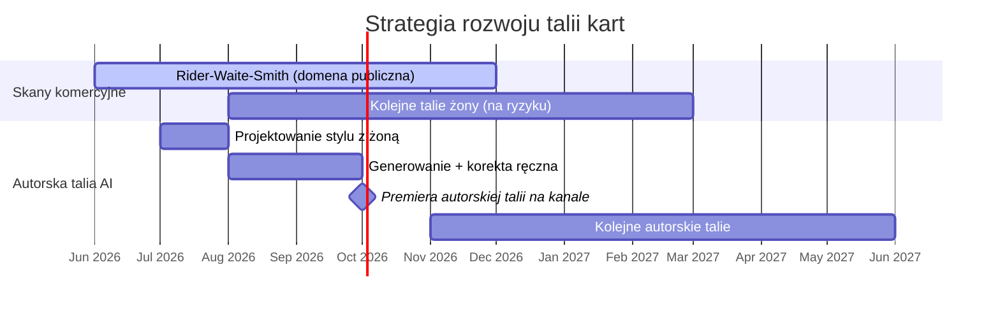
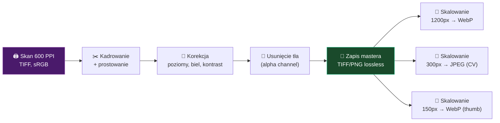
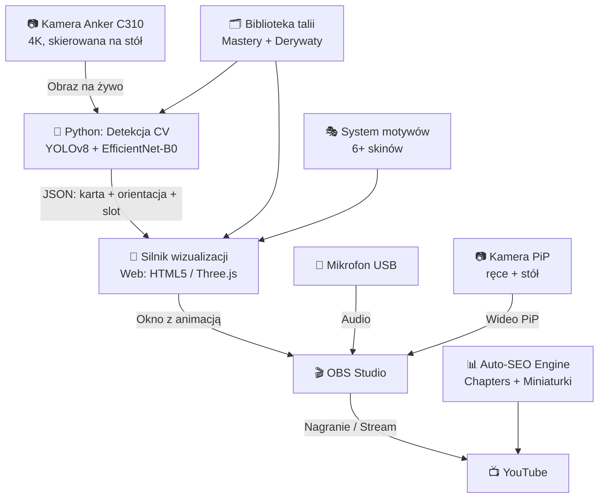

# 🃏 Projekt TAROT — Plan Koncepcyjny v4 (FINAL)

**Hybrydowy system rozpoznawania kart tarota z cyfrową wizualizacją dla kanału YouTube.**

> Wersja finalna koncepcji. Zawiera syntezę 6 raportów AI + decyzje projektowe.
> Pełna synteza raportów: [synteza_glowna.md](file:///e:/Antigravity/Projekty/TAROT/analizy/synteza/synteza_glowna.md)

---

## 1. Wizja projektu

Żona prowadzi kanał YT z czytaniami tarota. System **TarotVision** rozwiązuje problem jakości wizualnej filmów tarotowych:

- 📷 **Kamera Anker C310** rozpoznaje kartę wyłożoną na stole (warstwa techniczna)
- 🎨 **Aplikacja** wyświetla perfekcyjną cyfrową animację karty (warstwa prezentacji)
- 🎤 **Żona** interpretuje rozkład swoim głosem (warstwa autentyczności)
- 👐 **Widz** widzi realne ręce + cyfrowe karty + słyszy prawdziwą osobę

> „Nie budujemy narzędzia do «automatycznego wróżenia», tylko narzędzie do «doskonałej wizualizacji prawdziwego czytania»."

---

## 2. Kluczowe decyzje projektowe

| Decyzja | Wybór | Uzasadnienie |
|---------|-------|-------------|
| **Talie kart** | Start ze skanami komercyjnych talii, równoległy rozwój autorskiej | Szybki start, minimalne ryzyko przy małym kanale |
| **Pierwsza talia** | Rider-Waite-Smith (1909) | Domena publiczna, najbardzej rozpoznawalna |
| **Format treści** | Nagrania → później live | Komfort, możliwość powtórek |
| **Widoczność** | Ręce + stół zawsze, twarz = Patroni | Autentyczność + monetyzacja |
| **Język** | PL na start, EN jako rozszerzenie | i18n od początku |
| **CV** | Rozpoznawanie kamerą od początku | Bez fazy ręcznego klikania |
| **Styl wizualny** | Dynamiczny — motywy/skiny per czytanie | Żona decyduje o stylu |
| **Silnik** | Web (HTML5/JS/Three.js) na start | Najlepszy dla vibe codingu z AI |

---

## 3. Strategia: Pragmatyczny start + równoległy rozwój talii



| Faza | Okres | Talie | Ryzyko prawne |
|------|-------|-------|---------------|
| **Start** | Miesiąc 1-3 | Rider-Waite-Smith (1909, domena publiczna) | ✅ Zerowe |
| **Rozszerzanie** | Miesiąc 3-6 | Komercyjne talie żony + 1. autorska | 🟡 Niskie (mały kanał) |
| **Dojrzałość** | Miesiąc 6+ | Autorskie + komercyjne jako uzupełnienie | ✅ Minimalne |

---

## 4. Digitalizacja kart — Specyfikacja techniczna

> [!IMPORTANT]
> Jakość zeskanowanych kart bezpośrednio determinuje jakość wizualizacji na ekranie **i** skuteczność rozpoznawania przez CV. Warto to zrobić porządnie raz, a nie powtarzać wielokrotnie.

### 4.1 Metody digitalizacji

| Metoda | Jakość | Koszt | Rekomendacja |
|--------|--------|-------|-------------|
| **Flatbed scanner (600 PPI)** | ⭐⭐⭐⭐⭐ | Skaner ~200-400 zł | 🏆 **Najlepsza** — idealna ostrość, zero perspektywy, powtarzalne wyniki |
| **Copy stand + aparat** | ⭐⭐⭐⭐ | Statyw + oświetlenie | Dobra alternatywa jeśli masz aparat z makro |
| **Smartfon na statywie** | ⭐⭐⭐ | Minimalne | Akceptowalne na start z dobrym oświetleniem |
| **Kamera Anker C310** | ⭐⭐ | Już masz | ⚠️ Tylko do prototypowania — za mała rozdzielczość na assety finalne |

### 4.2 Dwupoziomowa biblioteka assetów

System utrzymuje **dwa poziomy** plików graficznych dla każdej karty:

```
biblioteka_talii/
├── rider-waite-smith/
│   ├── info.json                    ← metadane talii
│   ├── mastery/                     ← ARCHIWALNE ORYGINAŁY (nigdy nie edytuj!)
│   │   ├── 00_the_fool.tiff         ← 600 PPI, profil ICC, pełna karta
│   │   ├── 01_the_magician.tiff
│   │   ├── ...
│   │   └── 77_king_of_pentacles.tiff
│   ├── produkcja/                   ← DERYWATY DO UŻYCIA W APLIKACJI
│   │   ├── karty/                   ← karty do wizualizacji
│   │   │   ├── 00_the_fool.webp     ← PNG/WebP, przezroczyste tło, 1200px
│   │   │   └── ...
│   │   ├── wzorce_cv/               ← karty do rozpoznawania (mniejsze)
│   │   │   ├── 00_the_fool.jpg      ← JPEG, 300-400px, zoptymalizowane pod CV
│   │   │   └── ...
│   │   └── miniatury/               ← do UI panelu sterowania
│   │       ├── 00_the_fool_thumb.webp  ← 150px
│   │       └── ...
│   └── rewers/
│       └── back.webp                ← rewers karty (1 plik per talia)
```

### 4.3 Specyfikacje formatów

#### MASTERY (archiwalne)

| Parametr | Wartość | Dlaczego |
|----------|---------|----------|
| **Format** | TIFF (bez kompresji) lub PNG (lossless) | Brak utraty jakości, edytowalny w przyszłości |
| **Rozdzielczość** | **600 PPI** (minimum 300 PPI) | Standard archiwizacyjny, przyszłościowe |
| **Rozmiar pliku** | ~15-30 MB per karta (TIFF) | Dysk jest tani, jakość bezcenna |
| **Profil kolorów** | **sRGB** (z osadzonym profilem ICC) | Standard wyświetlania ekranowego |
| **Głębia koloru** | 24-bit (8 bit/kanał) lub 48-bit (16 bit) | 24-bit wystarczy, 48-bit = bonus |
| **Tło** | Białe/jednolite (do łatwego wycięcia) | Ułatwia usuwanie tła w postprocessingu |
| **Nazwa pliku** | `NN_nazwa_angielska.tiff` | Sortowalne, jednoznaczne |

#### DERYWATY PRODUKCYJNE (do aplikacji)

| Przeznaczenie | Format | Rozmiar | Tło | Uwagi |
|---------------|--------|---------|-----|-------|
| **Wizualizacja (ekran)** | WebP lub PNG | **1200×2100 px** (proporcje karty ~1:1.75) | Przezroczyste (alpha) | Główny asset wyświetlany widzowi |
| **Rozpoznawanie CV** | JPEG (q=90) | **300×525 px** | Oryginalne | Mniejszy = szybsze porównanie |
| **Miniatury UI** | WebP | **150×263 px** | Przezroczyste | Do panelu sterowania operatora |
| **Rewers** | WebP lub PNG | **1200×2100 px** | Przezroczyste | 1 plik per talia |

> [!TIP]
> **Dlaczego WebP a nie PNG dla produkcji?** WebP z przezroczystością jest 30-50% mniejszy niż PNG przy identycznej jakości. Szybsze ładowanie = płynniejsze animacje. PNG jest OK jako alternatywa jeśli narzędzia nie wspierają WebP.

### 4.4 Pipeline przetwarzania (skan → gotowy asset)



**Kroki szczegółowe:**

| # | Krok | Narzędzie | Czas per karta |
|---|------|-----------|---------------|
| 1 | Skan flatbed 600 PPI | Skaner + oprogramowanie | ~30 sek |
| 2 | Kadrowanie + prostowanie | GIMP / Photoshop / skrypt Python | ~1 min |
| 3 | Korekcja kolorów (levels, white balance) | GIMP / ImageMagick (batch) | ~30 sek |
| 4 | Usunięcie tła (wycinanie karty) | rembg (Python) / GIMP | ~1 min |
| 5 | Zapis mastera TIFF/PNG | Automatyczny | natychmiast |
| 6 | Generowanie derywatów (3 rozmiary) | Skrypt Python (Pillow/ImageMagick) | natychmiast |

**Szacowany czas dla pełnej talii (78 kart):**
- Skanowanie: ~1-2 godziny (z ustawieniem)
- Obróbka ręczna: ~2-3 godziny (jeśli automatyzacja background removal)
- Generowanie derywatów: ~5 minut (skrypt)
- **RAZEM: ~4-6 godzin per talia**

> [!TIP]
> **Automatyzacja:** Krok 4 (usuwanie tła) i krok 6 (generowanie derywatów) da się w pełni zautomatyzować skryptem Python. Przy kolejnych taliach praca ręczna to głównie krok 1 (skanowanie) i krok 3 (weryfikacja kolorów).

### 4.5 Wskazówki przy skanowaniu

| Problem | Rozwiązanie |
|---------|-------------|
| **Odblaski na foliowanych kartach** | Skanuj BEZ pokrywy skanera (zamknięcia). Połóż czarną tkaninę na karcie od góry. |
| **Krzywe ułożenie** | Użyj kątownika / linijki przy krawędzi skanera |
| **Niespójne kolory** | Skanuj partami w jednej sesji, nie zmieniaj ustawień skanera |
| **Grubość karty** | Dociśnij delikatnie książką od góry (przez tkaninę) |
| **Wiele kart naraz** | Skanuj maks. 4 karty na raz → wycinaj skryptem. Szybsze niż pojedynczo. |
| **Rewers** | Wystarczy 1 skan — rewers jest identyczny dla całej talii |

### 4.6 Metadane karty (info.json per talia)

```json
{
  "deck_name": "Rider-Waite-Smith",
  "deck_id": "rws_1909",
  "language": "pl",
  "copyright": "public_domain",
  "card_count": 78,
  "card_dimensions_mm": { "width": 70, "height": 120 },
  "scan_ppi": 600,
  "cards": [
    {
      "id": 0,
      "file_base": "00_the_fool",
      "name_pl": "Głupiec",
      "name_en": "The Fool",
      "arcana": "major",
      "number": "0",
      "meaning_upright_pl": "Nowy początek, niewinność, spontaniczność, wolny duch",
      "meaning_reversed_pl": "Lekkomyślność, ryzyko, brak doświadczenia"
    }
  ]
}
```

---

## 5. Architektura systemu



### Dwuetapowa detekcja kart

```
[Klatka z kamery] → [YOLOv8-nano: wykryj kartę + dłoń] 
                        → [Crop + deskew] 
                            → [EfficientNet-B0: rozpoznaj 1 z 78 kart + orientacja]
                                → [FSM: debouncing 10-15 klatek]
                                    → [LOCKED → Wizualizacja]
```

### Rekomendowany stos technologiczny

| Komponent | Technologia | Uzasadnienie |
|-----------|-------------|--------------|
| **Detekcja kart** | Python + YOLOv8 → EfficientNet-B0 | Dwuetapowe: odporność na zmienne warunki |
| **Detekcja dłoni** | MediaPipe Hands | Standard, 4/6 agentów rekomenduje |
| **Wizualizacja** | HTML5 + JavaScript + Three.js | Najlepszy dla vibe codingu z AI |
| **Komunikacja** | WebSocket (JSON) | Niska latencja, prostota |
| **Nagrywanie** | OBS Studio (Browser Source) | Standard branżowy, darmowy |
| **Baza danych** | SQLite + JSON | Prosta, lokalna, szybka |
| **Przetwarzanie assetów** | Python (Pillow + rembg) | Automatyzacja pipeline'u skanów |
| **Wielojęzyczność** | i18n (JSON) | PL/EN od początku |

---

## 6. System motywów wizualnych

| Motyw | Klimat | Użycie |
|-------|--------|--------|
| 🌑 **Mistyczny** | Fiolety, czernie, złoto, dym | Czytania ogólne |
| ✨ **Eteryczny** | Biele, srebra, delikatne blaski | Duchowe, anielskie |
| 🔥 **Dramatyczny** | Czerwienie, pomarańcze, cienie | Namiętność, konflikty |
| 🌸 **Romantyczny** | Róże, pastele, kwiaty | Miłosne |
| 🌊 **Wodny** | Turkusy, granatowe, księżyc | Intuicyjne, emocjonalne |
| 🌿 **Naturalny** | Zielenie, brązy, drewno | Zdrowie, rozwój |

---

## 7. Techniki anty-Uncanny Valley

Cyfrowa karta musi wyglądać jak fizyczna w idealnym oświetleniu, nie jak CGI:

| Technika | Opis |
|----------|------|
| **Contact shadows** | Cień Gauss 20px pod kartą |
| **Worn edge effect** | Postrzępione krawędzie SVG/PNG |
| **Proceduralny grain** | Szum dopasowany do ISO kamery |
| **Micro-niedoskonałości** | Rotacja ±0.8°, skala ±0.5% |
| **Opacity 92-95%** | Lekka przezroczystość |
| **Animacja ease_out_back** | Sprężysta, 350-450ms |
| **Film grain overlay** | 3% grain |

---

## 8. Kompozycja wideo

```
┌─────────────────────────────────────────────────────┐
│                                                     │
│       WARSTWA GŁÓWNA: Animowane karty na tle         │
│       motywu (mistyczny/romantyczny/etc.)            │
│                                                     │
│  ┌──────────────────┐                               │
│  │  PiP: Realny stół │  ← widok na ręce żony       │
│  │  z rękami + karty │     dowód autentyczności      │
│  └──────────────────┘                               │
│                                                     │
│  [✨ Koło Fortuny]    [Pozycja: Przyszłość]         │
│                                                     │
└─────────────────────────────────────────────────────┘
         + AUDIO: Głos żony (mikrofon USB)
```

---

## 9. Top 10 funkcjonalności

| # | Funkcjonalność | Priorytet |
|---|---------------|-----------|
| 1 | Rozpoznawanie kart kamerą (dwuetapowe CV) | 🔴 MVP |
| 2 | Wizualizacja AR z animacjami | 🔴 MVP |
| 3 | Pipeline digitalizacji kart (skan → assety) | 🔴 MVP |
| 4 | System motywów wizualnych | 🟡 v2 |
| 5 | Auto-Chapters YouTube | 🟡 v2 |
| 6 | Dual Version Export (YT + Shorts) | 🟡 v2 |
| 7 | Auto-miniaturki (dramatyczne karty) | 🟢 v3 |
| 8 | Dynamic Director (auto-reżyseria) | 🟢 v3 |
| 9 | E-SL (napisy z symboliką kart) | 🟢 v3 |
| 10 | Second Screen Companion (QR → telefon) | 🔵 v4 |

---

## 10. Plan działania

### Etap 0: Przygotowanie (1 tydzień)
- [ ] Zakup/pożyczenie flatbed skanera (lub test ze smartfonem)
- [ ] Zakup: mikrofon USB (~100-200 zł) + lampa LED (~30-80 zł)
- [ ] Przygotowanie stanowiska (stół, mata, oświetlenie)
- [ ] Skanowanie pierwszej talii (Rider-Waite-Smith, 78 kart, ~4-6h)
- [ ] Przetworzenie skanów → mastery + derywaty (skrypt Python)

### Etap 1: Proof of Concept (1-2 tygodnie)
- [ ] Detekcja 10 kart kamerą Anker (test YOLOv8)
- [ ] Wyświetlenie rozpoznanej karty na ekranie
- [ ] Test opóźnienia (<200ms)
- [ ] Test przechwytywania w OBS

### Etap 2: MVP — Pierwszy film na YT (3-4 tygodnie)
- [ ] Pełna detekcja 78 kart + orientacja
- [ ] Maszyna stanów + debouncing
- [ ] Detekcja dłoni (MediaPipe Hands)
- [ ] Pierwszy motyw wizualny (mistyczny)
- [ ] Animacje wejścia kart + efekty realizmu
- [ ] Layout: rozkład 3 kart + Krzyż Celtycki
- [ ] Kompozycja PiP + audio
- [ ] **PIERWSZY TESTOWY FILM NA YT** 🎉

### Etap 3: Polish + Automatyzacja (2-3 tygodnie)
- [ ] Auto-Chapters YouTube
- [ ] Więcej motywów (min. 3)
- [ ] Wielojęzyczność PL/EN
- [ ] Skanowanie kolejnych talii żony
- [ ] Auto-miniaturki

### Etap 4: Autorska talia + Skalowanie (ciągłe)
- [ ] Projektowanie autorskiej talii AI z żoną
- [ ] Generowanie + ręczna korekta
- [ ] Premiera autorskiej talii = event na kanale
- [ ] Live streaming
- [ ] Monetyzacja (Patronite, merch)

### Szacowany czas do pierwszego filmu: **6-8 tygodni**

---

## 11. Model monetyzacji

| Kanał | Treść | Dostęp |
|-------|-------|--------|
| **YouTube (publiczny)** | Nagrania czytań, edukacja, „Karta dnia" | Darmowy |
| **YouTube Shorts / TikTok** | 60s czytania, teasery | Darmowy (zasięg) |
| **Patronite / Patreon** | Prywatne czytania, twarz żony, raporty PDF | Tier 1-3 |
| **Etsy / Kickstarter** | Autorskie talie kart (fizyczne + cyfrowe) | Sprzedaż |

---

## 12. Otwarta kwestia przed startem implementacji

> [!IMPORTANT]
> **Wybór stylu wizualnego z żoną** — potrzebujemy decyzji o klimacie pierwszego motywu wizualizacji. Proponuję przygotować 3-4 mockupy wizualne do wyboru (mogę je wygenerować). Który motyw jako pierwszy: mistyczny, eteryczny, romantyczny?

---

*Plan koncepcyjny v4 (FINAL) — Projekt TAROT*
*Opracowany na podstawie syntezy 6 raportów AI + decyzji projektowych.*
*Data: 2026-05-28*
