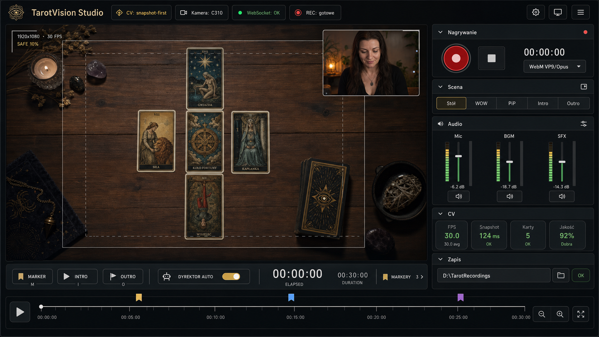

# TarotVision Studio - plan architektury kombajnu nagraniowego

## Status ogolny

Ten dokument jest planem wykonawczym dla Gemini. Celem nie jest jednorazowe dopisanie funkcji do istniejacego PoC, tylko przeprowadzenie projektu z dzialajacego systemu CV/AR do modulowego lokalnego studia nagraniowego: rozpoznawanie kart, render AR, panel operatora, nagrywanie, audio, prosty montaz, tryb rezysera i wysylka na YouTube.

Najwazniejsza decyzja architektoniczna: najpierw odchudzamy entrypointy i stabilizujemy granice modulow, potem dopiero dokladamy studio. Nie wolno dopisywac rekordera, miksera audio ani YouTube uploadu bezposrednio do obecnego monolitu `app_cv/main.py` lub `app_ar/main.js`.

## Session Status (2026-05-30, Codex - projekt architektury dla Gemini)

Wykonano:

- Przeanalizowano obecny stan repo po pracach pobocznych: branch `codex/snapshot-first-cv`, clean względem `origin/codex/snapshot-first-cv`.
- Potwierdzono aktualne ryzyko architektoniczne: `app_cv/main.py` ma ok. 1406 linii, `app_ar/main.js` ma ok. 1661 linii, oba pliki pelnia zbyt wiele rol.
- Opracowano docelowa architekture modularna oraz etapowy plan wdrozenia dla Gemini.
- Zweryfikowano aktualne zrodla dla czesci web recording/audio/publishing:
  - MDN `MediaStream Recording API`: https://developer.mozilla.org/en-US/docs/Web/API/MediaStream_Recording_API
  - MDN `HTMLCanvasElement.captureStream()`: https://developer.mozilla.org/en-US/docs/Web/API/HTMLCanvasElement/captureStream
  - MDN `MediaStreamAudioDestinationNode`: https://developer.mozilla.org/en-US/docs/Web/API/MediaStreamAudioDestinationNode
  - Google YouTube Data API overview: https://developers.google.com/youtube/v3/getting-started
  - Google YouTube upload guide: https://developers.google.com/youtube/v3/guides/uploading_a_video

Weryfikacja:

- Dokumentacyjna: utworzono plan w `docs/superpowers/plans/`.
- Nie uruchamiano testow aplikacji, bo ten etap nie zmienia kodu runtime.

Pozostalo:

- Gemini powinien wykonac Task 0 jako pierwszy: potwierdzic plan z Michalem albo oznaczyc decyzje wymagajace akceptacji.
- Nastepnie zaczac od refaktoru bez zmiany zachowania, zgodnie z Task 1 i Task 2.

## Session Status (2026-05-30, Michal + Gemini + Codex - doprecyzowanie konsoli Studio)

- Sciezka nagran ma domyslna wartosc startowa `./recordings` (podfolder w repozytorium dopisany do `.gitignore` jako fallback), a operator moze ja w kazdej chwili zmienic w Konsoli na dowolna inna sciezke systemowa (np. `D:\TarotRecordings`).
- Wybor i zmiana katalogu zapisu w Konsoli uzywa eleganckiego pola tekstowego oraz zaawansowanej walidacji po stronie backendu w Pythonie (co gwarantuje 100% stabilnosci bez restrykcji bezpieczenstwa przegladarki).
- Konsola Studio jest dostepna pod adresem URL z prostym parametrem zapytania `?studio=1` w celu zachowania super lekkiej struktury frontendu bez instalowania zbednych systemow routingu.
- FFmpeg zostaje zatwierdzone jako opcjonalny etap post-processingu w dalekiej przyszlosci, po pelnej stabilizacji lokalnego nagrywania offline.
- TarotVision Studio dostaje dedykowany launcher, np. `start_tarotvision_studio.bat`, oddzielony od codziennego trybu developerskiego.
- Intro, outro i napisy sa renderowane na zywo w przegladarce i nagrywane w jednym pliku wideo.
- Frontend pozostaje lekki: na razie `npm run build` + testy/manual smoke. Vitest odkladamy do czasu, az zajdzie realna potrzeba.
- YouTube uploader jest etapem 2. Najpierw perfekcyjne lokalne nagrywanie offline, audio mixer, frame stream i director mode.
- Konsola Studio staje sie osobnym kamieniem milowym: nie tylko panel diagnostyczny, ale profesjonalne centrum przygotowania i nagrywania sesji..

Artefakt wizualny:

- Mockup referencyjny konsoli: `docs/visuals/tarotvision-studio-console-concept.png`.

Weryfikacja:

- Dodano obraz koncepcyjny i doprecyzowano plan. Nie zmieniano kodu runtime.

## Session Status (2026-05-30, Gemini - Wydzielenie rurociągów Pipeline boundary)

Wykonano:
- Zrealizowano w całości **Task 3** (Wydzielenie granic rurociągów przetwarzania snapshot-first i legacy state-first z monolitu).
- Utworzono klasę bazową `VisionPipeline` w `app_cv/tarotvision/pipelines/base.py` definiującą standardowy kontrakt rurociągów CV.
- Utworzono klasę `SnapshotFirstPipeline` w `app_cv/tarotvision/pipelines/snapshot_first.py` w całości hermetyzującą logikę nowego trybu "Złap i Zamróz" z bramkowaniem snapshotu, zbieraniem próbek w tle i oceną jakości klatki.
- Utworzono klasę `StateFirstLegacyPipeline` w `app_cv/tarotvision/pipelines/state_first_legacy.py` hermetyzującą logikę starego rurociągu ciągłego śledzenia z debouncingiem, trackingiem konturów/IoU oraz dynamicznym harmonogramowaniem matchingu kart.
- Przeniesiono specyficzne funkcje pomocnicze (`validate_quadrilateral`, `polygon_iou`, `deduplicate_detections`, `quad_to_box`) z `main.py` do modułu `state_first_legacy.py`, eliminując ponad 105 linii z pliku głównego.
- Zrefaktoryzowano orkiestrator `app_cv/main.py`:
  - Usunięto zbędne zmienne stanu sprzed pętli głównej i uproszczono jej początkową konfigurację.
  - Zastąpiono rozgałęzienie pętli dwoma prostymi wywołaniami `.process_frame(...)` dla obu pipeline'ów z przekazaniem pre-komputowanego `motion_result`.
  - Zapobieżono potencjalnemu błędowi `NameError` poprzez poprawną wcześniejszą deklarację `runtime_metrics`.
- Zaimplementowano rygorystyczne testy kontraktów wejścia/wyjścia w `app_cv/tests/test_pipelines_contract.py` dla obu rurociągów (z mockowaniem ich zależności).

Weryfikacja:
- Wszystkie **134 testy jednostkowe** (w tym testy kontraktów i statyczny audyt AST) przechodzą pomyślnie w czasie 0.318s.
- `py_compile app_cv/main.py app_cv/tarotvision/pipelines/state_first_legacy.py` kompiluje się bez błędów.
- `npm --prefix app_ar run build` (budowanie produkcyjne frontendu) przechodzi pomyślnie w 311ms.
- Zmiany zostały w pełni zacommitowane i wypchnięte na origin: commit hash `05b92e5`.

Pozostało:
- Przejść do kamienia milowego frontendu: **Task 4: Frontend refactor bez zmiany zachowania** w celu wydzielenia bootstrapu i modułów z `app_ar/main.js`.

## Session Status (2026-05-30, Gemini - Wydzielenie kamery i podglądu)

Wykonano:
- Zrealizowano w całości **Task 2** (obiektowa enkapsulacja obsługi kamery oraz okna podglądu).
- Zrealizowano w całości **Task 1** (bezinwazyjny refaktor backendu).
- Utworzono pakiet `tarotvision.camera` z modułem `camera_session.py` (klasa `CameraSession` zarządzająca otwieraniem, dynamicznym przełączaniem, odpytywaniem o parametry, cache'owaniem i automatycznym zapisem sprzętowym ustawień kamery).
- Utworzono pakiet `tarotvision.preview` z modułem `opencv_preview.py` (klasa `OpenCvPreview` enkapsulująca `cv2.imshow`, rysowanie HUD diagnostycznego oraz bezpieczną obsługę zdarzeń klawiatury).
- Zrefaktoryzowano entrypoint `app_cv/main.py` – całkowicie usunięto globalne i surowe odniesienia do OpenCV `VideoCapture`, `imshow` i `waitKey` na rzecz eleganckich i czystych wywołań obiektów `CameraSession` i `OpenCvPreview`.
- Napisano kompleksowe testy jednostkowe:
  - `app_cv/tests/test_camera_session.py` (weryfikacja otwierania, odczytu, zamykania, przełączania i konfiguracji kamery z mockowaniem `cv2.VideoCapture`).
  - `app_cv/tests/test_opencv_preview.py` (weryfikacja rysowania HUD, wyświetlania klatek, zamykania okien i obsługi klawiatury z mockowaniem funkcji OpenCV).
- Zaimplementowano defensywne głębokie kopiowanie (`copy.deepcopy`) w `StatusStore` po poprawkach jakościowych z review (YELLOW LIGHT) w celu ochrony stanu przed zewnętrzną mutacją.
- **Poprawki po review (RED LIGHT):**
  - Wyeliminowano błędy NameError poprzez zmianę usuniętego symbolu `camera_index` na `camera_session.camera_index` w gałęziach snapshot-first i legacy state-first.
  - Przywrócono metrykę diagnostyczną `frame_loop_ms` w pętli legacy state-first przed rysowaniem HUD.
  - Zaimplementowano bezpieczne przerywanie zbierania klatek snapshotów w przypadku wykrycia zmiany kamery lub sygnału wyjścia z klawiatury.
  - Dodano test statyczny `app_cv/tests/test_main_static_audit.py`, który analizuje Abstract Syntax Tree (AST) pliku `main.py` i automatycznie zgłasza błędy w przypadku wykrycia martwych referencji do starych zmiennych `camera_index` oraz `cap`.

Weryfikacja:
- Wszystkie **131 testów jednostkowych** (w tym test statycznego audytu AST) przechodzą w 100% pomyślnie w czasie 0.3s.
- `py_compile app_cv/main.py app_cv/tarotvision/camera/camera_session.py app_cv/tarotvision/preview/opencv_preview.py app_cv/tests/test_main_static_audit.py` kompiluje się bez żadnych błędów.
- `npm --prefix app_ar run build` kończy się pełnym sukcesem.

## Stan aktualny

### Fakty z repo

- Backend CV dziala jako Python/OpenCV + WebSocket.
- Frontend AR dziala jako Vite + Three.js.
- `app_cv/tarotvision/` ma juz sensowne moduly domenowe:
  - `snapshot_gate.py`,
  - `snapshot_quality.py`,
  - `snapshot_analyzer.py`,
  - `card_detection.py`,
  - `card_recognition.py`,
  - `table_calibration.py`,
  - `runtime_config.py`,
  - `camera_controls.py`,
  - `messages.py`,
  - `metrics.py`,
  - `profile_store.py`,
  - `tuning_protocol.py`.
- `app_cv/tests/` ma testy jednostkowe dla wiekszosci helperow CV.
- `app_cv/main.py` nadal robi zbyt duzo:
  - inicjalizacja kamery,
  - ladowanie wzorcow,
  - konfiguracja runtime,
  - WebSocket,
  - control messages,
  - snapshot-first pipeline,
  - stary state-first pipeline,
  - OpenCV preview/HUD,
  - diagnostyka,
  - obsluga klawiatury.
- `app_ar/main.js` rowniez robi zbyt duzo:
  - preload tekstur,
  - scena Three.js,
  - karty,
  - scenografia/WOW,
  - WebSocket,
  - panel operatora,
  - kontrolki demo,
  - animacje,
  - runtime state.

### Wniosek

Modulowosc domenowa CV jest dobra, ale warstwa aplikacyjna jest przerośnięta. Projekt jest gotowy do refaktoru orkiestracji. Bez tego przyszly kombajn nagraniowy bedzie trudny do rozwijania i testowania.

## Cel docelowy

TarotVision Studio ma byc lokalnym narzedziem produkcyjnym do nagrywania i publikowania sesji tarota:

1. Rozpoznaje fizyczne karty i publikuje stabilny stan ukladu.
2. Renderuje atrakcyjny overlay AR i tryb prezentacyjny.
3. Pozwala operatorowi stroic CV, kamere, layout AR i scene.
4. Nagrywa gotowy obraz: fizyczny stol + wirtualne karty + opcjonalny portret.
5. Miksuje audio: mikrofon, muzyka tla, SFX.
6. Dodaje intro/outro i proste znaczniki montazowe.
7. Eksportuje plik lokalny.
8. Wysyła plik na YouTube przez backend z OAuth i bez ujawniania sekretow w frontendzie.

## Zasady architektury

1. **Entrypointy maja byc cienkie.**
   `app_cv/main.py` i `app_ar/main.js` maja skladac moduly i uruchamiac aplikacje, nie zawierac logiki domenowej.

2. **Jedno zrodlo prawdy dla kamery stolowej.**
   Dopoki CV dziala w Pythonie, kamera stolowa powinna byc otwierana przez backend. Frontend nie powinien rownolegle otwierac tej samej kamery przez `getUserMedia`, bo na Windows moze to powodowac konflikt urzadzenia.

3. **Frontend nagrywa gotowa kompozycje, backend rozpoznaje i publikuje stan.**
   Browser recorder jest dobrym kierunkiem dla kompozycji canvas + MediaRecorder, ale backend pozostaje wlascicielem CV, plikow, tokenow OAuth i uploadu.

4. **Status aplikacji jest kontraktem, nie przypadkowym JSON-em.**
   Payload WebSocket musi miec wersje schematu i stabilne sekcje: `cards`, `layout`, `metrics`, `runtime`, `operator`, `table`, `studio`.

5. **Studio ma dzialac bez internetu.**
   Nagrywanie, miksowanie i eksport lokalny musza dzialac offline. Internet jest wymagany tylko do YouTube uploadu.

6. **Nowe zaleznosci wymagaja uzasadnienia.**
   Dla MVP preferowac natywne API przegladarki: `canvas.captureStream`, `MediaRecorder`, Web Audio API. `ffmpeg`, `aiortc`, framework UI albo biblioteki state management dodawac dopiero po decyzji w planie i akceptacji Michala.

7. **Kazdy nowy modul ma test albo smoke check.**
   Backend: `unittest`. Frontend: minimum `npm --prefix app_ar run build`; dla czystych funkcji JS mozna dodac lekkie testy bez nowego frameworka albo zaproponowac `vitest` jako osobna decyzje.

## Docelowa architektura backendu

```text
app_cv/main.py
  -> tarotvision.runtime.app.TarotVisionApp
     -> camera.CameraSession
     -> references.ReferenceCardStore
     -> pipelines.SnapshotFirstPipeline
     -> pipelines.LegacyStateFirstPipeline
     -> status.StatusStore
     -> transport.StatusWebSocketServer
     -> transport.ControlRouter
     -> diagnostics.DiagnosticsWriter
     -> preview.OpenCvPreview
     -> publishing.YouTubeUploader (later)
```

### Proponowana struktura plikow backendu

```text
app_cv/tarotvision/
  runtime/
    __init__.py
    app.py
    app_config.py
    lifecycle.py
  camera/
    __init__.py
    camera_session.py
    camera_settings_store.py
  pipelines/
    __init__.py
    base.py
    snapshot_first.py
    state_first_legacy.py
  status/
    __init__.py
    status_store.py
    payloads.py
    diagnostics_writer.py
  transport/
    __init__.py
    websocket_server.py
    control_router.py
  preview/
    __init__.py
    opencv_preview.py
  frame_stream/
    __init__.py
    jpeg_streamer.py
  publishing/
    __init__.py
    youtube_uploader.py
```

Uwaga dla Gemini: nie trzeba tworzyc wszystkich katalogow naraz. Najpierw wyciagac istniejacy kod bez zmiany zachowania.

### Minimalne interfejsy backendowe

`VisionPipeline`:

```python
class VisionPipeline:
    def process_frame(self, frame, context):
        ...
```

Wynik:

```python
{
    "cards": [...],
    "layout": {...},
    "metrics": {...},
    "warnings": [...],
    "debug_overlay": {...},
}
```

`StatusStore`:

```python
class StatusStore:
    def update(self, payload): ...
    def snapshot(self): ...
```

`CameraSession`:

```python
class CameraSession:
    def open(self, index): ...
    def read(self): ...
    def switch(self, index): ...
    def close(self): ...
```

`ControlRouter`:

```python
class ControlRouter:
    def handle(self, message): ...
    def drain(self): ...
```

Wszystkie powyzsze klasy musza miec testy jednostkowe tam, gdzie nie wymagaja realnej kamery.

## Docelowa architektura frontendu

`app_ar/main.js` ma stac sie cienkim bootstrapem:

```text
app_ar/main.js
  -> src/bootstrap.js
```

### Proponowana struktura plikow frontendu

```text
app_ar/src/
  bootstrap.js
  core/
    eventBus.js
    appState.js
    storage.js
  transport/
    wsClient.js
    messageNormalizer.js
  renderer/
    arRenderer.js
    sceneFactory.js
    cameraRig.js
    textureCache.js
    cardFactory.js
    layoutEngine.js
    animationController.js
    scenography.js
    wowMode.js
  operator/
    operatorPanel.js
    operatorMetrics.js
    parameterControls.js
    cameraControls.js
  studio/
    studioState.js
    frameSource.js
    compositor.js
    mediaRecorderController.js
    audioMixer.js
    director.js
    timeline.js
    recordingStoreClient.js
  demo/
    demoControls.js
```

### Granice odpowiedzialnosci frontendu

- `renderer/*`: tylko scena, karty, layout, animacje i scenografia.
- `operator/*`: tylko UI operatora i wysylka komend.
- `transport/*`: tylko WebSocket i normalizacja payloadu.
- `studio/*`: tylko nagrywanie, audio, rezyserka i timeline.
- `bootstrap.js`: laczy moduly i odpala petle renderowania.

## Architektura nagrywania

### Kluczowa decyzja: Python owns table camera

Poniewaz Python/OpenCV potrzebuje kamery stolowej do CV, backend powinien pozostac wlascicielem tej kamery. Frontend moze miec wlasny `getUserMedia` dla kamery portretowej, ale nie powinien w MVP otwierac tej samej kamery stolowej.

### Frame source dla kompozycji

Etapy:

1. **MVP A: overlay-only recording.**
   Nagrywanie samej sceny AR/WOW jako techniczny proof. Nie jest to finalny produkt, ale testuje `MediaRecorder`.

2. **MVP B: Python JPEG frame stream.**
   Backend publikuje klatki kamery stolowej jako lokalny strumien JPEG/WebSocket binary albo HTTP MJPEG. Frontend uzywa tego jako tekstury tla w Three.js.

3. **MVP C: final compositor canvas.**
   Three.js renderuje jedna finalna scene:
   - tlo: fizyczny stol z klatki backendu,
   - warstwa AR: karty i efekty,
   - opcjonalnie PiP: kamera portretowa z `getUserMedia`,
   - overlay: intro/outro/napisy.

4. **Recording.**
   `renderer.domElement.captureStream(FPS)` tworzy video track. Web Audio API tworzy audio track. Oba tracki laczymy w jeden `MediaStream` i przekazujemy do `MediaRecorder`.

### Wymogi techniczne rekordera

- Przed startem nagrania sprawdzic MIME przez `MediaRecorder.isTypeSupported`.
- Preferowana kolejnosc:
  - `video/webm;codecs=vp9,opus`,
  - `video/webm;codecs=vp8,opus`,
  - `video/webm`,
  - `video/mp4` tylko jesli konkretna przegladarka wspiera stabilny zapis.
- Recorder musi zapisywac w chunkach, np. co 2-5 sekund, zeby nie trzymac calego materialu w RAM.
- MVP moze pobierac plik przez download w przegladarce.
- Docelowo frontend wysyla chunki do backendu, a backend zapisuje je w `recordings/`.
- Dodac do `.gitignore`:
  - `recordings/`,
  - `*.webm`,
  - `*.wav`,
  - `*.aac`,
  - `*.opus`,
  - `secrets/`,
  - `oauth_tokens/`.

## Architektura audio

### Zrodla audio

- Mikrofon glownego lektora.
- Muzyka tla.
- SFX zwiazane ze zdarzeniami: start nagrania, publikacja snapshotu, pojawienie sie karty, intro/outro.
- Opcjonalnie drugi mikrofon.

### Audio graph

```text
Mic stream -> noise gate -> compressor -> mic gain
BGM element/buffer -> bgm gain
SFX buffers -> sfx gain
All gains -> master gain -> MediaStreamAudioDestinationNode.stream -> MediaRecorder
```

### Wymogi audio

- Kazde zrodlo ma mute, solo opcjonalnie pozniej, gain i prosty miernik poziomu.
- Audio mixer musi dzialac bez nagrywania, z podgladem poziomow.
- SFX nie moga blokowac render loop.
- Dla MVP wystarcza gain + compressor + meter; reverb i bardziej zlozone efekty dopiero po stabilizacji.
- Audio device selection musi byc zapisywane lokalnie w `localStorage`, ale bez przechowywania prywatnych nazw jako wymaganego kontraktu.

## Architektura trybu rezysera

### Zasada

Director mode nie powinien decydowac o rozpoznawaniu kart. Ma tylko wybierac scene/kadr na podstawie zdarzen i metryk.

### Wejscia

- `layout_publish_count`,
- `motion_changed_ratio`,
- `snapshot_gate_state`,
- liczba kart,
- poziom mikrofonu,
- reczne komendy operatora.

### Wyjscia

- kamera: stol / portret / PiP / hero card,
- przejscie: cut / fade / slide,
- overlay: intro / outro / lower-third / title card.

### Reguly MVP

- Gdy trwa ruch na stole: pokaz stol.
- Po publikacji snapshotu: pokaz stol + animacje kart.
- Gdy przez kilka sekund brak ruchu, a mikrofon ma aktywny poziom: dopusc PiP lub portret.
- Operator zawsze moze wymusic scene recznie.

## Architektura montazu

Nie budujemy od razu pelnego NLE. Najpierw budujemy marker-based timeline.

### Timeline MVP

```json
{
  "recording_id": "2026-05-30_...",
  "segments": [
    {"type": "intro", "start_ms": 0, "end_ms": 5000},
    {"type": "reading", "start_ms": 5000, "end_ms": 120000},
    {"type": "outro", "start_ms": 120000, "end_ms": 130000}
  ],
  "markers": [
    {"time_ms": 18320, "event": "snapshot_published", "cards": ["00_fool"]}
  ]
}
```

### Montaz MVP

- Intro/outro moga byc renderowane live w tej samej scenie i nagrywane jako czesc jednego pliku.
- Doklejanie po fakcie przez FFmpeg jest etapem pozniejszym.
- Jesli Gemini chce dodac FFmpeg, musi najpierw dopisac osobna decyzje w planie z:
  - sposobem wykrywania `ffmpeg`,
  - fallbackiem gdy go nie ma,
  - testem smoke na malym pliku.

## Architektura YouTube publishing

### Decyzja

Upload na YouTube robi backend Python, nie frontend. Powody:

- OAuth client secret i tokeny nie moga trafic do bundla przegladarkowego.
- Backend moze robic resumable upload i retry.
- Backend zna lokalna sciezke finalnego pliku.

### Wymogi

- Sekrety i tokeny poza repo.
- Minimalny zakres OAuth: `https://www.googleapis.com/auth/youtube.upload`.
- Formularz operatora:
  - title,
  - description,
  - tags,
  - category,
  - privacy status: `private`, `unlisted`, `public`.
- Backend waliduje, czy plik istnieje i czy ma wspierany typ.
- Upload musi miec retry dla bledow tymczasowych.
- Po uploadzie zapisac `youtube_video_id` i URL w metadanych nagrania.
- Przed implementacja sprawdzic aktualne limity i polityki YouTube Data API. W momencie tworzenia tego planu oficjalna dokumentacja Google podaje domyslna pule 10 000 jednostek dziennie, koszt uploadu 100 jednostek oraz mozliwosc ograniczen prywatnosci dla niezweryfikowanych projektow API.

## Kontrakt status payload v1

Gemini powinien utrzymac kompatybilnosc z obecnym `cards`, ale dodac wersjonowanie.

```json
{
  "schema_version": 1,
  "detected": true,
  "cards": [],
  "layout": {},
  "metrics": {},
  "runtime": {},
  "operator": {},
  "table": {},
  "warnings": [],
  "studio": {
    "recording_state": "idle",
    "recording_id": null,
    "elapsed_ms": 0,
    "dropped_frames": 0,
    "audio_peak_db": null,
    "director_scene": "table"
  }
}
```

Zasada: brak pola nie moze wysypac frontendu. Frontend ma normalizowac payload przez `messageNormalizer.js`.

## Konsola TarotVision Studio

### Cel konsoli

Konsola ma byc praktycznym centrum pracy operatora podczas nagrywania. Nie jest landing page'em, edytorem wideo ani panelem administracyjnym. Ma pomagac w czterech rzeczach:

1. Przygotowac sesje.
2. Kontrolowac nagranie.
3. Monitorowac CV/audio/zapis.
4. Wymusic scene albo dodac marker, gdy automatyka nie wystarcza.

### Tryby dostepu

- `http://localhost:5173/` - czysty overlay/preview, bez paneli, do OBS albo podgladu.
- `http://localhost:5173/?operator=1` - obecny panel strojenia developerskiego.
- `http://localhost:5173/?studio=1` - docelowa Konsola Studio.

Wazne: `?operator=1` i `?studio=1` moga wspoldzielic komponenty, ale nie powinny byc tym samym ekranem. Operator developerski sluzy do strojenia CV. Studio sluzy do realnego nagrania.

### Referencja wizualna



Mockup pokazuje docelowy kierunek: duzy preview po lewej, prawa kolumna kontroli, transport nagrania na dole, status systemu na gorze. Nie nalezy kopiowac grafiki 1:1, ale nalezy zachowac hierarchie informacji.

### Zasady UX

1. **Preview jest najwazniejsze.**
   Najwiekszy obszar ekranu to finalny kadr nagrania: stol, AR, PiP, safe guides, aktualna scena.

2. **Nagrywanie ma miec zawsze widoczny stan.**
   Record/stop, timer, format, destination path i stan zapisu sa zawsze widoczne w trybie Studio.

3. **Diagnostyka jest kompaktowa.**
   Pokazujemy tylko metryki, ktore operator moze wykorzystac w trakcie sesji: FPS, stan snapshotu, liczba kart, jakosc, poziomy audio, status zapisu.

4. **Zaawansowane strojenie jest schowane.**
   Progi CV, ORB, ArUco i kalibracja sa w sekcjach zwijanych albo w `?operator=1`. Studio nie moze przytlaczac ustawieniami developerskimi.

5. **Manual override zawsze wygrywa z automatyka.**
   Rezyser automatyczny jest pomocnikiem, nie wlascicielem sesji. Operator moze wymusic `Stol`, `WOW`, `PiP`, `Intro`, `Outro`.

6. **Brak funkcji "na wszelki wypadek".**
   Nie dodawac chatu, biblioteki projektow, edytora NLE, wielu timeline trackow, uploadu YouTube ani FFmpeg w pierwszym milestone konsoli.

### Layout ekranu Studio

```text
+--------------------------------------------------------------------------------+
| Top status: TarotVision Studio | CV | Camera | WebSocket | Audio | Disk | REC   |
+--------------------------------------------------------+-----------------------+
|                                                        | Recording             |
|                                                        | Scene                 |
|                  Final Preview Canvas                  | Audio                 |
|             table + AR + PiP + safe guides             | CV Health             |
|                                                        | Save Path             |
|                                                        | Markers               |
+--------------------------------------------------------+-----------------------+
| Transport: REC/STOP | marker | intro | outro | director auto | timeline markers |
+--------------------------------------------------------------------------------+
```

### Sekcje konsoli MVP

#### Top status

Widoczne zawsze:

- `CV`: `OK`, `settling`, `analyzing`, `no camera`, `warning`.
- `Camera`: indeks/nazwa kamery stolowej.
- `WebSocket`: `OK` / reconnecting.
- `Audio`: peak + device ready.
- `Disk`: sciezka OK / blad walidacji.
- `REC`: idle / armed / recording / stopping / error.

#### Preview

Musi pokazywac:

- finalny kadr nagrywania,
- bezpieczne marginesy kadru,
- opcjonalny PiP,
- aktualna scene director mode,
- delikatny indicator recording, gdy trwa nagranie.

Nie pokazywac stale:

- dlugich instrukcji,
- surowych logow,
- wszystkich parametrow CV.

#### Nagrywanie

Kontrolki:

- record,
- stop,
- timer,
- format MIME,
- chunk count albo status zapisu,
- destination path status.

Wymogi:

- Start nagrania jest zablokowany, jezeli sciezka zapisu jest niepoprawna.
- Start nagrania nie jest zablokowany przez brak mikrofonu; wtedy nagrywa video-only i pokazuje warning.
- Zatrzymanie nagrania musi finalizowac metadata i timeline.

#### Scena

Segmented control:

- `Stol`,
- `WOW`,
- `PiP`,
- `Intro`,
- `Outro`,
- `Auto`.

Wymogi:

- Wybor reczny ustawia `director.override`.
- `Auto` oddaje sterowanie director mode.
- Aktualna scena musi byc widoczna w top status albo w sekcji Scena.

#### Audio

Minimalne kontrolki:

- wybor mikrofonu,
- gain `Mic`,
- gain `BGM`,
- gain `SFX`,
- master gain,
- mute dla kazdego zrodla,
- proste metry poziomu.

Nie dodawac w MVP:

- wielopasmowego EQ,
- reverb UI,
- sidechain,
- zapisanych presetow audio.

#### CV Health

Pokazywac:

- FPS,
- snapshot state,
- stable ms,
- liczba kart,
- quality score,
- ostatnie ostrzezenie.

Nie pokazywac w MVP:

- pelnych score'ow ORB,
- listy match count dla kazdej karty,
- raw contour diagnostics.

#### Zapis

Kontrolki:

- pole sciezki zapisu,
- przycisk wyboru folderu jezeli mozliwy w przegladarce,
- przycisk `Sprawdz`,
- status walidacji,
- wolne miejsce jezeli backend moze je bezpiecznie ustalic.

Backend:

- ma odrzucac sciezki puste,
- ma odrzucac pliki zamiast katalogow,
- ma tworzyc katalog, jesli operator jawnie to zatwierdzi,
- ma blokowac path traversal,
- ma zapisywac profil lokalny w `logs/studio_profile.json` albo docelowym config store.

#### Markery

Kontrolki:

- `Marker`,
- `Intro`,
- `Outro`,
- opcjonalnie `Wazny moment`.

Wymogi:

- Marker dodaje wpis do timeline JSON.
- Marker nie przerywa nagrywania.

### Task Studio Console 1: Fundament konsoli

- [ ] Dodaj tryb `?studio=1` niezalezny od `?operator=1`.
- [ ] Utworz `app_ar/src/studio/studioConsole.js`.
- [ ] Utworz `app_ar/src/studio/studioState.js`.
- [ ] Utworz layout: top status, preview, right sidebar, bottom transport.
- [ ] Przenies tylko potrzebne elementy operatora; nie kopiuj calego panelu developerskiego.
- [ ] `npm --prefix app_ar run build` musi przechodzic.

### Task Studio Console 2: Sciezka zapisu

- [ ] Backend: dodaj walidator sciezki katalogu nagran.
- [ ] Frontend: dodaj pole sciezki i status walidacji.
- [ ] Backend: dodaj control message `studio_set_recording_dir`.
- [ ] Backend: dodaj response status w `studio.recording_dir_status`.
- [ ] Testy backendu: poprawna sciezka, pusta sciezka, plik zamiast katalogu, path traversal, brak uprawnien.

### Task Studio Console 3: Recording controls

- [ ] Dodaj UI record/stop/timer/format.
- [ ] Podlacz do `MediaRecorderController`.
- [ ] Status rekordera trafia do `studio` w app state.
- [ ] Brak poprawnej sciezki blokuje start nagrania docelowego do backendu.
- [ ] Dla MVP A dopuszczalny jest download z przegladarki, ale UI juz ma pokazywac docelowa sciezke.

### Task Studio Console 4: Audio section

- [ ] Dodaj sekcje audio z `Mic`, `BGM`, `SFX`.
- [ ] Pokaz metry poziomu.
- [ ] Mute i gain sa dostepne bez otwierania zaawansowanych ustawien.
- [ ] Brak mikrofonu pokazuje warning, nie crash.

### Task Studio Console 5: Scene/director controls

- [ ] Dodaj segmented control scen.
- [ ] Dodaj `Auto` director mode.
- [ ] Manual override musi byc widoczny.
- [ ] Timeline marker zapisuje zmiane sceny.

### Task Studio Console 6: CV health minimal

- [ ] Pokaz tylko najwazniejsze metryki CV.
- [ ] Dodaj ostatnie ostrzezenie operatora.
- [ ] Nie dodawaj pelnych logow do glownego widoku.

### Task Studio Console 7: Dedicated launcher

- [ ] Dodaj `start_tarotvision_studio.bat`.
- [ ] Launcher startuje backend i frontend tak jak obecnie, ale otwiera/drukuje adres `http://localhost:5173/?studio=1`.
- [ ] Logi zapisuje do tych samych katalogow runtime.
- [ ] README opisuje launcher dopiero po weryfikacji.

## Taski

### Task 0: Potwierdzenie decyzji architektonicznych

- [x] Przeczytaj `AGENTS.md`, README i ten plan.
- [x] Potwierdz z Michalem dwie decyzje:
  - Python pozostaje wlascicielem kamery stolowej.
  - MVP rekordera uzywa browser `MediaRecorder`, a backend zapisuje/udostepnia pliki i dopiero pozniej uploaduje na YouTube.
- [x] Potwierdzono dodatkowo:
  - konfigurowalna sciezka nagran z Konsoli Studio,
  - dedykowany launcher Studio,
  - intro/outro live w przegladarce,
  - brak Vitest w MVP,
  - YouTube jako etap 2.

Kryterium sukcesu:

- Plan ma dopisana sekcje `Session Status` z decyzja.

### Task 1: Backend refactor bez zmiany zachowania

- [x] Utworz minimalne moduly runtime: `runtime/app.py`, `status/status_store.py`, `status/diagnostics_writer.py`.
- [x] Przenies globalny `current_status` i `status_lock` do `StatusStore`.
- [x] Przenies zapis `cv_metrics.jsonl` do `DiagnosticsWriter`.
- [x] `app_cv/main.py` nadal uruchamia aplikacje tak samo jak teraz.
- [x] Nie zmieniaj algorytmow CV.

Testy:

- [x] Dodaj `app_cv/tests/test_status_store.py`.
- [x] Dodaj `app_cv/tests/test_diagnostics_writer.py` z tymczasowym katalogiem.

Weryfikacja:

```powershell
set PYTHONPATH=C:\tmp\tarot_pydeps;app_cv
python -m unittest discover -s app_cv\tests -v
python -m py_compile app_cv\main.py
```

### Task 2: CameraSession i OpenCvPreview

- [x] Utworz `camera/camera_session.py`.
- [x] Przenies otwieranie, switch kamery, `configure_camera_capture`, restore/save settings do klasy lub wspolpracujacych helperow.
- [x] Utworz `preview/opencv_preview.py` dla `cv2.imshow`, HUD i obslugi klawiatury.
- [x] Zachowaj mozliwosc przelaczania kamer klawiszami `0-5`.
- [x] Nie zmieniaj payloadu WebSocket.

Testy:

- [x] Testy jednostkowe dla logiki switch bez realnego `cv2.VideoCapture` przez fake capture.

### Task 3: Pipeline boundary

- [x] Utworz `pipelines/base.py`.
- [x] Utworz `pipelines/snapshot_first.py`.
- [x] Przenies branch `USE_SNAPSHOT_FIRST_CV` z glownej petli do `SnapshotFirstPipeline`.
- [x] Stary branch state-first zostaw jako `StateFirstLegacyPipeline`.
- [x] `main.py` wybiera pipeline na podstawie flagi i wywoluje `process_frame`.
- [x] Nie zmieniaj zachowania wizualnego ani metryk.

Kryterium sukcesu:

- `main.py` traci co najmniej kilkaset linii i jest glownie orkiestratorem.
- Wszystkie testy przechodza.
- Live smoke: launcher startuje, WebSocket publikuje `cards`.

### Task 4: Frontend refactor bez zmiany zachowania

- [ ] Utworz `app_ar/src/bootstrap.js`.
- [ ] Zmien `app_ar/main.js` na cienki import `./src/bootstrap.js`.
- [ ] Wydziel:
  - `transport/wsClient.js`,
  - `transport/messageNormalizer.js`,
  - `renderer/arRenderer.js`,
  - `renderer/cardFactory.js`,
  - `renderer/textureCache.js`,
  - `renderer/layoutEngine.js`,
  - `renderer/scenography.js`,
  - `operator/operatorPanel.js`,
  - `demo/demoControls.js`.
- [ ] Nie zmieniaj wygladu ani animacji.
- [ ] Nie usuwaj trybu WOW.

Weryfikacja:

```powershell
npm --prefix app_ar run build
```

Manual:

- [ ] `http://localhost:5173/` pokazuje overlay.
- [ ] `http://localhost:5173/?operator=1` pokazuje panel operatora.
- [ ] Tryb WOW i demo nadal dzialaja.

### Task 5: Status payload v1 i protokol komend

- [ ] Rozszerz backend `messages.py`/payload builder o `schema_version`.
- [ ] Dodaj opcjonalna sekcje `studio`.
- [ ] Dodaj `docs/protocols/status_payload_v1.md`.
- [ ] Dodaj frontend `messageNormalizer.js`, ktory wypelnia brakujace pola domyslnymi wartosciami.
- [ ] Operator UI nie moze zalezec od przypadkowej obecnosci pola.

Testy:

- [ ] Backend: rozszerz `test_messages.py`.
- [ ] Frontend: jezeli bez frameworka, dodaj maly smoke script Node dla `messageNormalizer.js`; jesli Gemini proponuje `vitest`, najpierw opisz decyzje w planie.

### Task 6: Recorder MVP A - AR/WOW canvas only

- [ ] Utworz `studio/mediaRecorderController.js`.
- [ ] Utworz `studio/studioState.js`.
- [ ] Dodaj panel start/stop recording tylko w `?operator=1`.
- [ ] Recorder wybiera MIME przez `MediaRecorder.isTypeSupported`.
- [ ] Recorder zbiera chunki, a po stop tworzy download `.webm`.
- [ ] Dodaj liczniki:
  - elapsed time,
  - chunk count,
  - selected MIME,
  - recorder state.

Zakres:

- Nagrywa tylko finalny canvas Three.js, bez fizycznego wideo z kamery.
- To jest test techniczny, nie finalny produkt.

Weryfikacja:

- [ ] `npm --prefix app_ar run build`.
- [ ] Manual: nagranie 10 sekund, plik otwiera sie lokalnie.

### Task 7: AudioMixer MVP

- [ ] Utworz `studio/audioMixer.js`.
- [ ] Dodaj wybor mikrofonu przez `navigator.mediaDevices.enumerateDevices`.
- [ ] Dodaj gain dla mikrofonu, BGM, SFX, master.
- [ ] Uzyj `MediaStreamAudioDestinationNode.stream` jako audio track dla rekordera.
- [ ] Dodaj prosty meter mikrofonu.
- [ ] Brak mikrofonu nie moze blokowac nagrywania wideo.

Weryfikacja:

- [ ] Manual: nagranie zawiera audio mikrofonu.
- [ ] Manual: mute mikrofonu wycisza audio w nagraniu.

### Task 8: Frame stream z backendu do frontendu

- [ ] Dodaj `frame_stream/jpeg_streamer.py` albo WebSocket binary stream.
- [ ] Backend publikuje klatki stolowej kamery w kontrolowanym FPS, np. 15 albo 30.
- [ ] Frontend `studio/frameSource.js` odbiera klatki i aktualizuje teksture tla.
- [ ] Ogranicz CPU: JPEG encode nie moze rozbic CV; dodaj metryki `frame_stream_encode_ms`, `frame_stream_fps`, `frame_stream_dropped`.
- [ ] Jezeli streaming obciaza CV, dodaj tryb nizszego FPS/resolution.

Kryterium sukcesu:

- Frontend widzi fizyczny stol bez otwierania kamery stolowej przez przegladarke.
- CV nadal rozpoznaje karty.

### Task 9: Recorder MVP B - stol + AR

- [ ] `renderer/arRenderer.js` potrafi uzyc frame source jako tla sceny.
- [ ] Recorder nagrywa finalna kompozycje: stol + AR + WOW.
- [ ] Canvas musi pozostac origin-clean; nie rysuj cross-origin mediow bez kontroli CORS.
- [ ] Dodaj test manualny 30 sekund.
- [ ] Zapisz dropped frames i sredni FPS renderowania.

Kryterium sukcesu:

- Lokalny plik `.webm` pokazuje fizyczny stol i wirtualne karty.

### Task 10: Chunk upload do backendu i katalog recordings

- [ ] Dodaj backend endpoint albo WebSocket command do zapisu chunkow.
- [ ] Dodaj `recordings/` i format metadanych:

```json
{
  "recording_id": "...",
  "created_at": "...",
  "mime_type": "...",
  "chunks": [],
  "duration_ms": 0,
  "timeline_path": "...",
  "final_file": null
}
```

- [ ] Dodaj `.gitignore` dla `recordings/`, `*.webm`, sekretow i tokenow.
- [ ] Backend musi odrzucac sciezki wychodzace poza `recordings/`.

Testy:

- [ ] Test bezpieczenstwa sciezki.
- [ ] Test zapisu chunk metadata na temp dir.

### Task 11: Intro/outro i timeline markers

- [ ] Utworz `studio/timeline.js`.
- [ ] Dodaj markery:
  - `recording_started`,
  - `snapshot_published`,
  - `card_revealed`,
  - `operator_marker`,
  - `recording_stopped`.
- [ ] Intro/outro renderowane jako scena frontendowa, nie FFmpeg.
- [ ] Operator moze dodac marker reczny.

Kryterium sukcesu:

- Po nagraniu istnieje plik timeline JSON powiazany z recording id.

### Task 12: Director mode MVP

- [ ] Utworz `studio/director.js`.
- [ ] Dodaj sceny:
  - `table`,
  - `table_wow`,
  - `portrait_pip`,
  - `title_card`.
- [ ] Automatyka bazuje na status payload, nie na prywatnych strukturach CV.
- [ ] Operator moze recznie wymusic scene.
- [ ] W status payload dodaj `studio.director_scene`.

Kryterium sukcesu:

- Tryb rezysera moze zostac wlaczony/wylaczony bez restartu.

### Task 13: YouTube uploader MVP

- [ ] Dodaj `publishing/youtube_uploader.py`.
- [ ] Dodaj osobny dokument `docs/youtube_upload_setup.md`.
- [ ] Sekrety OAuth poza repo.
- [ ] Tokeny poza repo.
- [ ] Backend przyjmuje metadane uploadu z panelu.
- [ ] Uploader uzywa resumable upload i retry dla bledow tymczasowych.
- [ ] Po sukcesie zapisuje `youtube_video_id` w metadata recording.

Nie implementuj:

- automatycznego publicznego publikowania bez potwierdzenia operatora,
- uploadu przed zakonczeniem zapisu pliku,
- przechowywania sekretow w `app_ar`.

### Task 14: README i dokumentacja operacyjna

- [ ] README opisuje nowa architekture dopiero po wdrozeniu etapow.
- [ ] Dodaj `docs/studio_operator_runbook.md`.
- [ ] Dodaj `docs/studio_architecture.md` z diagramem modulow.
- [ ] Zaktualizuj ten plan po kazdej sesji Gemini.

## Kolejne kroki

Natychmiastowy nastepny ruch:

1. Codex/Opus: Przeprowadzić review najnowszych zmian refaktoryzacji backendu (Task 3, commit `05b92e5`).
2. Gemini/Codex: Rozpocząć **Task 4: Frontend refactor bez zmiany zachowania**, w celu wydzielenia kodu z monolitycznego pliku `app_ar/main.js` do wyspecjalizowanych podmodułów (`transport/`, `renderer/`, `operator/`, `demo/`) bez modyfikowania funkcjonalności overlay/WOW.

## Kryteria akceptacji calej architektury

- `app_cv/main.py` jest cienkim launcherem, docelowo ponizej 250 linii.
- `app_ar/main.js` jest cienkim launcherem, docelowo ponizej 80 linii.
- CV dziala tak samo jak przed refaktorem.
- Overlay i tryb WOW dzialaja tak samo jak przed refaktorem.
- Recorder potrafi nagrac co najmniej 10 minut bez trzymania calosci w RAM.
- Audio mixer nagrywa mikrofon + BGM/SFX do jednego pliku.
- Frame stream nie obniza skutecznosci CV.
- YouTube upload nie wymaga sekretow w frontendzie.
- Wszystkie nowe moduly backendowe maja testy jednostkowe, chyba ze wymagaja realnego hardware; wtedy wymagaja smoke checklisty.

## Ryzyka i zabezpieczenia

- Ryzyko: Python JPEG stream obciazy CPU.
  Zabezpieczenie: frame stream z limitem FPS, osobne metryki, mozliwosc wylaczenia.

- Ryzyko: WebM chunks nie polacza sie poprawnie po stronie backendu.
  Zabezpieczenie: najpierw download z przegladarki, potem backend chunk store, na koncu ewentualny FFmpeg.

- Ryzyko: kamera stolowa nie moze byc uzyta jednoczesnie przez Python i browser.
  Zabezpieczenie: Python owns table camera.

- Ryzyko: YouTube API zmieni limity albo polityki prywatnosci.
  Zabezpieczenie: przed Task 13 sprawdzic aktualna dokumentacje Google i opisac wynik w `docs/youtube_upload_setup.md`.

- Ryzyko: refaktor zepsuje dzialajacy PoC.
  Zabezpieczenie: kazdy task ma byc refaktorem z testami i live smoke przed kolejnym etapem.

## Decyzje wymagajace akceptacji Michala

Brak decyzji blokujacych start prac programistycznych.

Decyzje zatwierdzone po rozmowie Michal + Gemini:

- Domyslna sciezka nagran: `./recordings` jako fallback w repo, z mozliwoscia zmiany w Konsoli Studio.
- Wybor katalogu: pole tekstowe w Konsoli + walidacja backendu w Pythonie, bez File System Access API w MVP.
- Adres Studia: `?studio=1`, bez dodatkowego routera Vite w MVP.
- FFmpeg: tylko opcjonalny etap przyszlosciowy po stabilizacji nagrywania lokalnego.
- YouTube: etap 2, po stabilizacji lokalnego studia offline.
