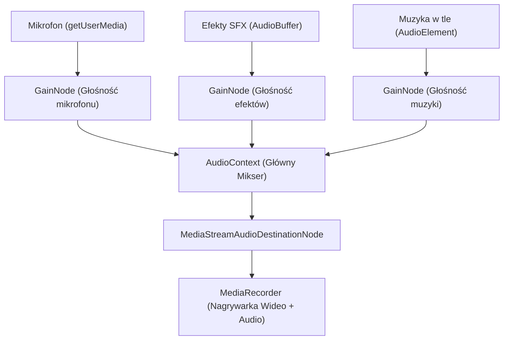

# Specyfikacja Przyszłościowa: Zintegrowany Rejestrator Wideo i Mikser Audio (Pełny Kombajn)

Ten dokument opisuje wizję i architekturę techniczną rozbudowy systemu TarotVision o bezpośrednie nagrywanie wideo oraz miksowanie audio (eliminując potrzebę korzystania z OBS Studio do celów rejestracji lokalnej).

---

## 📺 1. Zintegrowane Nagrywanie Wideo (AR Overlay Video Recorder)

Bezpośrednie nagrywanie gotowego obrazu (fizyczne wideo z kamery + wyrenderowane wirtualne karty 3D z Three.js) zaimplementujemy w oparciu o **architekturę frontendową (Opcja Web-Recorder)**.

### Architektura Techniczna
1. **Przechwytywanie wideo:** Przeglądarka pobiera obraz z fizycznej kamery za pomocą `navigator.mediaDevices.getUserMedia` (lub odbiera zoptymalizowany strumień wideo MJPEG bezpośrednio z backendu Pythona).
2. **Kompozycja AR:** Obraz z kamery jest renderowany jako statyczne tło 2D, na które nakładana jest trójwymiarowa scena Three.js (karty wirtualne).
3. **Rejestracja płótna (Canvas):** Wykorzystujemy natywną metodę przeglądarki `canvas.captureStream(FPS)` do generowania strumienia klatek wideo o stałym klatkażu (np. 30 lub 60 FPS).
4. **Kodowanie:** Gotowy strumień wideo przekazujemy do silnika `MediaRecorder` przeglądarki, który przy użyciu sprzętowego kodowania GPU kompresuje obraz do formatu WebM (VP8/VP9) lub MP4 (H.264/H.265).

---

## 🎵 2. Zintegrowany Mikser Audio (Headless Audio Mixer)

Równolegle z obrazem wideo, "kombajn" może przetwarzać i miksować wiele źródeł dźwięku w czasie rzeczywistym.

### Źródła dźwięku do zmiksowania:
*   **Mikrofon Streamera:** Głos lektora czytającego rozkład kart.
*   **Dźwięki Systemowe / Efekty (SFX):** Kliknięcia, szum przewracanych kart, mistyczna sygnatura dźwiękowa przy zablokowaniu karty (LOCKED).
*   **Muzyka w tle (BGM):** Opcjonalna, klimatyczna ścieżka dźwiękowa puszczana w pętli bezpośrednio z biblioteki TarotVision.

### Implementacja za pomocą Web Audio API (Frontend)
Przeglądarki internetowe posiadają niezwykle potężny silnik audio, który idealnie nadaje się do stworzenia wbudowanego miksera:

1. **Węzły Głośności (`GainNode`):** Pozwalają operatorowi na niezależną regulację głośności mikrofonu, muzyki i efektów bezpośrednio z suwaków w panelu operatora (dokładnie tak jak w fizycznym mikserze audio!).
2. **Filtry i Efekty:** Web Audio API pozwala na dodawanie filtrów w locie (np. bramka szumów dla mikrofonu, delikatny pogłos/reverb dodający mistycznego klimatu do głosu lektora).
3. **Synchronizacja w `MediaRecorder`:** Zmiksowany strumień audio z `MediaStreamAudioDestinationNode` jest łączony bezpośrednio ze strumieniem wideo z canvasu w jeden plik wyjściowy.

---

## 🎬 3. Automatyczny Montaż (Intro, Outro, Dżingle) i Publikacja YouTube

Kombajn może automatycznie scalać materiał w spójny film bez jakiejkolwiek edycji w programach trzecich.

### Automatyczny Montaż
*   **Intro wejściowe:** Na początku nagrywania odtwarza się przygotowany plik wideo z animacją logotypu (np. z przezroczystością). Strumień wideo z płótna automatycznie nagrywa intro przed aktywacją widoku kamer.
*   **Interaktywne dżingle:** System odtwarza mistyczny dźwięk (SFX) w słuchawkach i na nagraniu w precyzyjnych momentach (np. podczas wykrycia snapshotu lub odsłonięcia karty "Śmierć" czy "Diabeł").
*   **Outro końcowe:** Po zatrzymaniu nagrywania system automatycznie dokleja planszę końcową (np. animowany ekran końcowy z linkami do mediów społecznościowych).

### Publikacja jednym przyciskiem (YouTube API)
Po wyrenderowaniu pliku na dysku (lub w chmurze), backend Pythona może zintegrować się z **YouTube Data API v3**:
*   W panelu operatora pojawia się formularz: *Tytuł*, *Opis*, *Tagi* oraz *Widoczność* (Publiczne, Niepubliczne, Prywatne).
*   Kliknięcie "Wyślij na YouTube" automatycznie przesyła plik bezpośrednio na Twój kanał (bardzo wygodne np. przy wysyłaniu dedykowanych rozkładów niepublicznym linkiem dla klientów prywatnych!).

---

## 🎥 4. Tryb Multikamery i Reżysera (Director Mode)

Zamiast jednego, statycznego kadru, możemy obsłużyć **dwie kamery fizyczne jednocześnie** oraz dynamiczne przejścia kinematograficzne.

### Źródła obrazu (3 warstwy):
1.  **Kamera A (Główna - Stół):** Widok z góry pokazujący fizycznie rozkładane karty i markery.
2.  **Kamera B (Portret - Twarz):** Kamera skierowana na twarz lektora, budująca bezpośrednią relację z widzem.
3.  **Warstwa C (Wirtualna AR):** Trójwymiarowa nakładka kart z Three.js.

### Inteligentny Reżyser (Smart Switcher):
Oba fizyczne strumienie z kamer są wczytywane jako dynamiczne tekstury w Three.js, co pozwala na tworzenie niesamowitych efektów przełączania w czasie rzeczywistym:
*   **Picture-in-Picture (Obraz w obrazie):** Widok twarzy lektora w małym, eleganckim okręgu w rogu ekranu, nałożony na stół roboczy.
*   **Przejścia kinowe:** Płynne przenikanie (crossfade) lub przesunięcie (slide) kadru z twarzy na stół w momencie, gdy system CV wykryje ruch ręki kładącej kartę.
*   **Automatyczne przejścia:** System automatycznie pokazuje zbliżenie na twarz, gdy lektor mówi (brak ruchu na stole), i płynnie przełącza się na zbliżenie stołu z wirtualnymi kartami, gdy dochodzi do snapshotu.

Dzięki temu wideo staje się niesamowicie dynamiczne i atrakcyjne dla oka, sprawiając wrażenie profesjonalnie zmontowanego materiału telewizyjnego realizowanego przez całą ekipę filmową!
