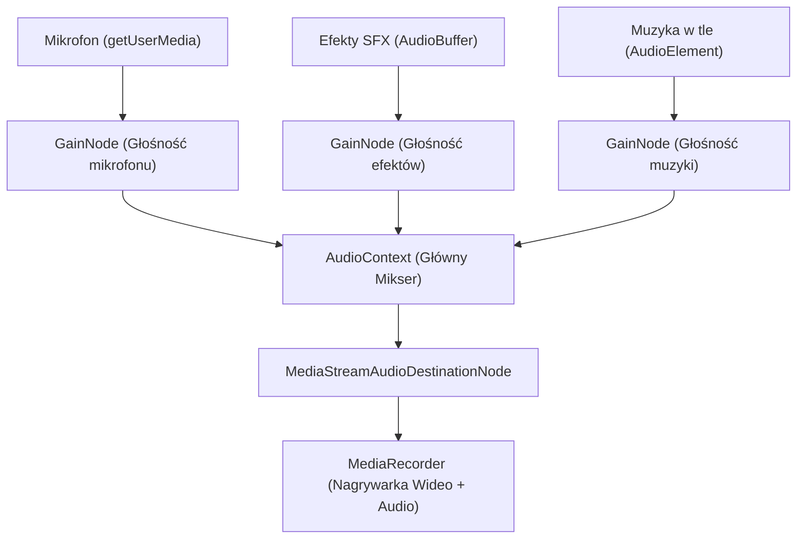

# Specyfikacja Przyszłościowa: Zintegrowany Rejestrator Wideo i Mikser Audio (Pełny Kombajn)

Ten dokument opisuje wizję i architekturę techniczną rozbudowy systemu TarotVision o bezpośrednie nagrywanie wideo oraz miksowanie audio (eliminując potrzebę korzystania z OBS Studio do celów rejestracji lokalnej).

---

## 📺 1. Zintegrowane Nagrywanie Wideo (AR Overlay Video Recorder)

Bezpośrednie nagrywanie gotowego obrazu (fizyczne wideo z kamery + wyrenderowane wirtualne karty 3D z Three.js) zaimplementujemy w oparciu o **architekturę frontendową (Opcja Web-Recorder)**.

### Architektura Techniczna
1. **Przechwytywanie wideo:** Przeglądarka pobiera obraz z fizycznej kamery za pomocą `navigator.mediaDevices.getUserMedia` (lub odbiera zoptymalizowany strumień wideo MJPEG bezpośrednio z backendu Pythona).
2. **Kompozycja AR:** Obraz z kamery jest renderowany jako statyczne tło 2D, na które nakładana jest trójwymiarowa scena Three.js (karty wirtualne).
3. **Rejestracja płótna (Canvas):** Wykorzystujemy natywną metodę przeglądarki `canvas.captureStream(FPS)` do generowania strumienia klatek wideo o stałym klatkażu (np. 30 lub 60 FPS).
4. **Kodowanie:** Gotowy strumień wideo przekazujemy do silnika `MediaRecorder` przeglądarki, który przy użyciu sprzętowego kodowania GPU kompresuje obraz do formatu WebM (VP8/VP9) lub MP4 (H.264/H.265).

---

## 🎵 2. Zintegrowany Mikser Audio (Headless Audio Mixer)

Równolegle z obrazem wideo, "kombajn" może przetwarzać i miksować wiele źródeł dźwięku w czasie rzeczywistym.

### Źródła dźwięku do zmiksowania:
*   **Mikrofon Streamera:** Głos lektora czytającego rozkład kart.
*   **Dźwięki Systemowe / Efekty (SFX):** Kliknięcia, szum przewracanych kart, mistyczna sygnatura dźwiękowa przy zablokowaniu karty (LOCKED).
*   **Muzyka w tle (BGM):** Opcjonalna, klimatyczna ścieżka dźwiękowa puszczana w pętli bezpośrednio z biblioteki TarotVision.

### Implementacja za pomocą Web Audio API (Frontend)
Przeglądarki internetowe posiadają niezwykle potężny silnik audio, który idealnie nadaje się do stworzenia wbudowanego miksera:

1. **Węzły Głośności (`GainNode`):** Pozwalają operatorowi na niezależną regulację głośności mikrofonu, muzyki i efektów bezpośrednio z suwaków w panelu operatora (dokładnie tak jak w fizycznym mikserze audio!).
2. **Filtry i Efekty:** Web Audio API pozwala na dodawanie filtrów w locie (np. bramka szumów dla mikrofonu, delikatny pogłos/reverb dodający mistycznego klimatu do głosu lektora).
3. **Synchronizacja w `MediaRecorder`:** Zmiksowany strumień audio z `MediaStreamAudioDestinationNode` jest łączony bezpośrednio ze strumieniem wideo z canvasu w jeden plik wyjściowy.

---

## 📂 Plik wyjściowy (Gotowy produkt)
Po kliknięciu "Zatrzymaj nagrywanie", przeglądarka generuje jeden plik (np. `tarot_reading_2026-05-29.mp4`), który zawiera:
*   Płynny obraz 1080p lub 4k z idealnie nałożonymi, stabilnymi kartami 3D.
*   Idealnie zsynchronizowaną ścieżkę dźwiękową (Twój głos + klimatyczna muzyka w tle + efekty dźwiękowe pojawiania się wirtualnych kart).

Plik ten jest natychmiast gotowy do wrzucenia na YouTube, TikToka lub wysłania klientowi!

---

## 📝 Status Pomysłu Rozwojowego
*   **Projekt:** Samodzielna aplikacja TarotVision Studio.
*   **Priorytet:** Średni (Future Feature).
*   **Złożoność:** Średnia (Wymaga przeniesienia pobierania strumienia kamery na frontend lub rozbudowania WebSocket o przesyłanie strumienia wideo).
