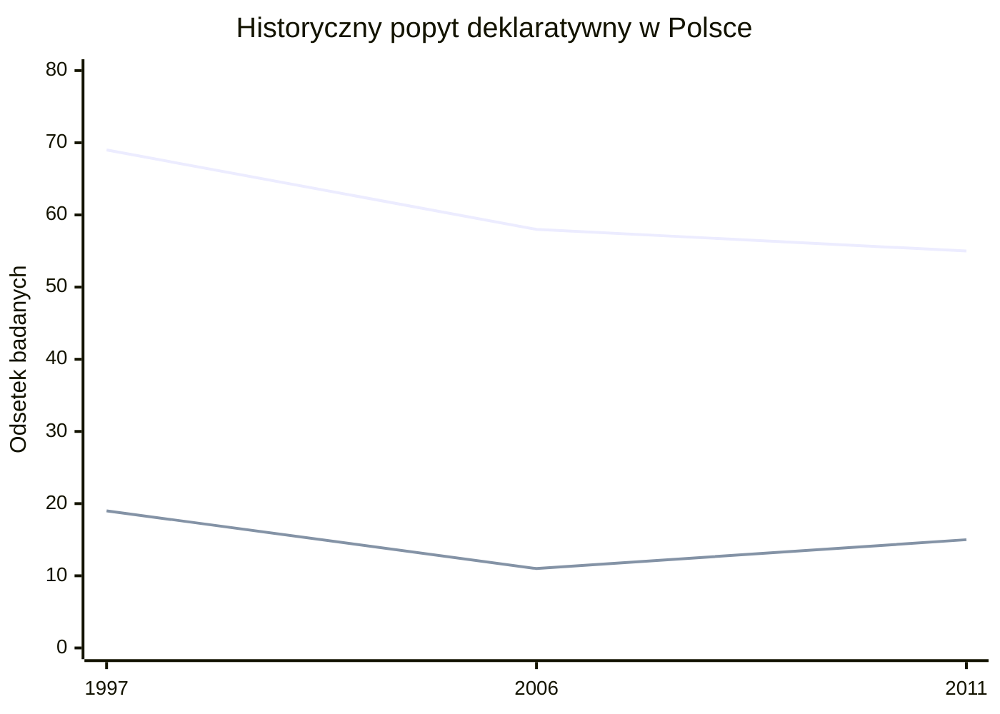
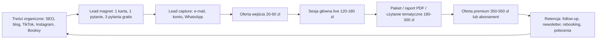
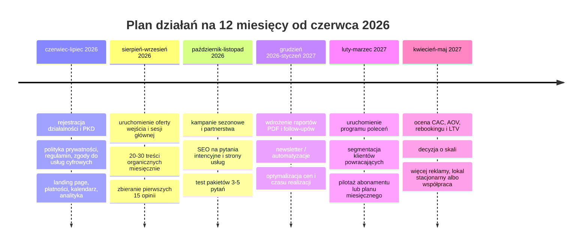

# Analiza rynku usług ezoterycznych i czytań tarota w Polsce

## Streszczenie wykonawcze

Rynek usług tarota i pokrewnych usług ezoterycznych w Polsce jest **realny, rozproszony i komercyjnie aktywny**, ale **słabo mierzalny statystycznie**. Główny problem metodologiczny polega na tym, że działalność astrologów i wróżbitów nie funkcjonuje w oficjalnych statystykach jako osobna branża; jest „schowana” w szerokiej klasie PKD 96.09.Z, która obejmuje także m.in. biura matrymonialne, agencje hostess oraz część usług związanych ze zwierzętami domowymi. W konsekwencji **aktualna wartość rynku, bieżące przychody branży i liczba aktywnych usługodawców tarota w Polsce pozostają publicznie nieokreślone**. Jedynym szerzej cytowanym historycznym benchmarkiem jest prasowy szacunek z 2012 r., według którego szeroko rozumiany polski rynek ezoteryczny był wart ok. **2 mld zł rocznie**, obsługiwał ok. **1,2 mln klientów rocznie** w kanałach telefon/SMS i obejmował ok. **15 tys. zarejestrowanych usługodawców**; te liczby traktuję jako punkt odniesienia historyczny, a nie bieżący pomiar rynku 2026. citeturn41view2turn39search1turn7search0

Najsolidniejsze oficjalne dane popytowe pochodzą z CBOS. W 2011 r. **15% dorosłych Polaków deklarowało, że było kiedykolwiek u wróżki/wróża**, przy czym kobiety robiły to dużo częściej niż mężczyźni (**22% vs 7%**). W tym samym badaniu **55%** badanych deklarowało czytanie horoskopów. Segmentacja historyczna pokazuje wyższy udział korzystających z wróżb wśród kobiet, mieszkańców największych miast oraz osób w wieku 35–44 i 65+, a nieco niższy wśród najmłodszych i mieszkańców małych miast. Nowszej, porównywalnej metodologicznie ogólnopolskiej serii popytowej dla samego tarota nie znalazłem. citeturn36view0turn36view3turn37view0

W 2026 r. rynek jest wyraźnie **bardziej cyfrowy** niż dekadę temu. Już w 2009 r. prasa opisywała portale ezoteryczne działające przez internet, e-mail, czat, GSM i SMS, a w 2026 r. obserwujemy dojrzałe formy cyfrowe: konsultacje przez WhatsApp i Google Meet, raporty PDF, aplikacje, szybkie sesje tekstowe, marketplace’y rezerwacyjne oraz abonamenty. Ten kierunek wspiera ogólna infrastruktura popytu online: według GUS w 2025 r. **96,2%** gospodarstw domowych miało internet, **69,7%** osób kupowało online, **75%** korzystało z komunikatorów, a **57%** zamawiało towary lub usługi przez internet. citeturn8search4turn22search0turn20view1turn21view2turn38search0turn38search45

Analiza przykładowych ofert pokazuje czytelne pasma cenowe. **Wejściowe, asynchroniczne usługi online** kosztują zwykle od **20 do 60 zł** za proste pytanie albo krótki rozkład; **trzon rynku live** lokuje się mniej więcej w zakresie **110–210 zł** za sesję telefoniczną lub online; **pozycjonowanie premium** potrafi sięgać **350–550 zł** za 60–90 minut. Równolegle rośnie model abonamentowy: przykładowo jedna z nowych polskich platform oferuje plan od **29 zł miesięcznie** z limitem wiadomości i rozkładów, a część dostawców stosuje darmowe wejścia, rabaty lub „pakiety pytań”, co wskazuje na znaczną **wrażliwość cenową** rynku oraz na potrzebę budowania lejka sprzedażowego, a nie wyłącznie sprzedaży jednorazowych sesji. citeturn22search0turn14search0turn15search1turn15search3turn42search2turn42search5turn24search0turn23search0turn21view0turn21view2turn16search1turn16search2

Wniosek biznesowy jest prosty: **najbardziej obiecujący model dla nowego usługodawcy w Polsce to model hybrydowy** — tani produkt wejścia online, główna usługa live 45–60 minut, potem pakiety/raporty i umiarkowana retencja, a dopiero na końcu abonament. Ekonomicznie to biznes o **wysokiej marży brutto gotówkowej**, ale tylko pod warunkiem dyscypliny w zarządzaniu czasem właściciela, opiniami, etyką komunikacji oraz zgodnością z prawem konsumenckim dla usług na odległość i treści/usług cyfrowych. citeturn31search1turn31search0turn32search1turn29search0turn29search2turn28search2

## Definicja rynku i wielkość

Najważniejsze zastrzeżenie analityczne brzmi: **nie istnieje publiczna, czysta seria statystyczna „rynek tarota w Polsce”**. W praktyce działalność tarotowa trafia do klasy **PKD 96.09.Z Pozostała działalność usługowa, gdzie indziej niesklasyfikowana**, która obejmuje także działalność astrologiczną i spirytystyczną, ale jednocześnie również biura towarzyskie i matrymonialne, agencje hostess czy usługi związane z opieką nad zwierzętami domowymi. Dlatego oficjalne dane o liczbie podmiotów czy przychodach w tej klasie nie mogą być automatycznie traktowane jako dane o samym tarocie. Z biznesowego punktu widzenia oznacza to, że **wielkość rynku, liczba usługodawców i tempo wzrostu pozostają publicznie nieokreślone**. citeturn41view2turn39search1

Jako historyczny punkt odniesienia można wykorzystać medialny szacunek z 2012 r.: ok. **2 mld zł rocznie** dla szeroko rozumianej ezoteryki, ok. **15 tys. zarejestrowanych usługodawców** oraz ok. **1,2 mln klientów rocznie** korzystających z porad telefonicznych i SMS-owych. To nie jest dane oficjalne GUS i nie powinno być bezpośrednio przenoszone na 2026 r., ale dobrze pokazuje, że branża miała w Polsce znaczącą skalę jeszcze przed masową platformizacją i obecnym modelem mobile-first. citeturn7search0

Najbardziej wiarygodna porównywalna seria popytu historycznego pochodzi z CBOS. Widać z niej, że popyt deklaratywny nie zniknął, choć jego forma zapewne się zmieniła: czytanie horoskopów spadło między 1997 a 2011 r., a korzystanie z wróżek po spadku w 2006 r. wróciło do poziomu **15%** w 2011 r. Przy braku nowszych ogólnopolskich pomiarów można to odczytywać jako sygnał, że popyt nie tyle zanikł, ile **przesunął się z kanałów tradycyjnych do cyfrowych i platformowych**. To już jednak jest wniosek inferencyjny, nie bezpośrednia obserwacja statystyczna. citeturn36view0turn37view0turn8search4turn22search0

Rynek bieżący da się dziś lepiej opisać przez **proxy podaży** niż przez oficjalny rachunek przychodów. W wyszukiwaniu OLX fraza **„tarot wróżka”** zwracała **201 ogłoszeń**, a fraza **„wróżka tarot”** — **189 ogłoszeń**, z czego **115** w kategorii „Usługi”. To nie jest reprezentatywny spis wszystkich usługodawców, ale pokazuje, że popyt i podaż funkcjonują już nie tylko przez własne strony, lecz także przez szerokie marketplace’y ogłoszeniowe. Dodatkowo jedna z polskich platform stricte ezoterycznych deklaruje już **ponad 15 tys. sesji** i **50 tys. rozmów**, co potwierdza istnienie skali transakcyjnej w cyfrowym segmencie rynku. citeturn25search0turn25search2turn22search0

Kanałowo rynek można dziś podzielić na cztery warstwy. Pierwsza to **asynchroniczny online**: e-mail, wiadomości tekstowe, audio, PDF. Druga to **live online/telefon**: Google Meet, WhatsApp, połączenia. Trzecia to **stacjonarne konsultacje premium**. Czwarta, rosnąca, to **subskrypcje i platformy 24/7**. Ten obraz jest spójny zarówno z dawnymi opisami portali działających przez czat, GSM i SMS, jak i z aktualnymi cennikami i interfejsami polskich ofert. citeturn8search4turn14search0turn15search1turn21view2turn22search0turn20view1

## Popyt i profil klienta

Na poziomie twardych danych historycznych profil klienta jest dość czytelny. W badaniu CBOS kontakt z wróżką deklarowało **22% kobiet** i **7% mężczyzn**. W podziale wiekowym najwyższe wartości miały grupy **35–44 lata** i **65+** — po **21%**, a najniższy poziom deklarowali **uczniowie i studenci** oraz grupa **18–24 lata** — po **2%**. Geograficznie wyróżniały się największe miasta (**20%** w miastach 501 tys.+), a najsłabiej wypadały małe miasta do 20 tys. mieszkańców (**9%**). Jednocześnie CBOS zaznaczał, że zainteresowanie przepowiedniami nie zależało wyraźnie od wykształcenia, sytuacji materialnej ani religijności. citeturn36view0turn36view3turn37view0

Warto jednak uważać z mechanicznym przenoszeniem tego profilu na 2026 r. Jest bardzo prawdopodobne, że badanie z 2011 r. **niedoszacowuje młodszy, online-only segment**, który nie musi korzystać ze „stacjonarnej wróżki”, lecz używa treści wideo, chatu, komunikatorów i form pisemnych. To przypuszczenie wspierają dwa fakty: po pierwsze, infrastruktura cyfrowa w Polsce jest dziś prawie powszechna; po drugie, nowsze badania jakościowe spoza Polski pokazują, że młodsi użytkownicy traktują tarot często jako narzędzie samorefleksji, emocjonalnego wsparcia i wspólnoty interpretacyjnej, a nie wyłącznie dosłownej „przepowiedni”. Dla polskiego rynku po 2011 r. brak jednak równie dobrej, reprezentatywnej serii. citeturn38search0turn38search45turn11search0turn11search1turn11search2

Jeśli chodzi o **motywacje zakupowe**, z polskich źródeł historycznych widać przede wszystkim stałe tematy: **miłość, praca, pieniądze, zdrowie, sprawy rodzinne i decyzje życiowe**. To samo potwierdza strona podażowa w 2026 r. — dominują oferty „miłosne”, relacyjne, decyzyjne i rozwojowe. Mystic Lights eksponuje problemy sercowe i rozkład partnerski; Tarrin akcentuje relacje, kierunek życia, odzyskanie kontroli i zmianę; Pryzmat24 porządkuje profile ekspertów wokół relacji, karmy, finansów, czasu i decyzji. W praktyce oznacza to, że tarot konkuruje nie tylko z innymi usługami ezoterycznymi, ale też z arbitralnie rozumianym „coachingiem decyzji”, treściami self-help i lekkim wellbeingiem emocjonalnym. citeturn18search4turn23search0turn21view0turn21view2turn22search0

Częstotliwość korzystania także nie jest jednorodna. W CBOS z 2011 r. **9%** badanych było u wróżki **raz**, **5%** — **kilka razy**, a **1%** — **wiele razy**. To sugeruje typowy rynek złożony z szerokiego kręgu okazjonalnych klientów i znacznie węższego, ale komercyjnie cenniejszego segmentu powracającego. W 2026 r. platformy abonamentowe próbują właśnie ten drugi segment monetyzować: przykładowo Pryzmat24 oferuje plan **Premium od 29 zł/mies.** z limitem wiadomości dziennie i wariant **Premium+** z nielimitowanymi rozmowami. citeturn36view3turn22search0

Gotowość do płacenia jest szeroka, ale rynek wydaje się **wrażliwy cenowo na wejściu**. Dowodzą tego darmowe lub bardzo tanie punkty startowe: **pierwsze 3 pytania gratis**, „jedna karta” za **20–35 zł**, „jedno pytanie” za **30–50 zł**, konsultacja wstępna za **40 zł**, a nawet duże rabaty promocyjne. Jednocześnie segment premium istnieje i działa — zwłaszcza tam, gdzie produkt jest opakowany jako osobista konsultacja, marka ekspercka albo pogłębiona sesja live. W praktyce oznacza to, że klient zwykle chce **taniego, niskiego ryzyka wejścia**, ale część z nich jest gotowa zapłacić dużo więcej po zbudowaniu zaufania. citeturn22search0turn14search0turn24search0turn23search0turn21view0turn16search2turn16search1

## Konkurencja i cenniki ofert

Poniższa tabela nie jest pełnym rynkiem, lecz **kontrolowaną próbką publicznie dostępnych ofert** z polskich serwisów, marketplace’ów i stron własnych. Jej wartość polega nie na „rankingu”, lecz na pokazaniu struktury cen, formatów dostarczania usługi, dodatków i sposobów akwizycji klienta.

| Oferta / usługodawca | Format | Czas | Cena | Dodatkowe usługi / wartość dodana | Kanały marketingu | Opinie / oceny | Źródło |
|---|---|---:|---:|---|---|---|---|
| Avatah — 1 pytanie e-mail/WhatsApp | online, asynchronicznie | 30 min | 35 zł | zdjęcie rozkładu, odpowiedź tekst/audio | Booksy, Instagram, Facebook, strona | 5,0 / 41 opinii | Booksy listing citeturn14search0 |
| Avatah — 3 pytania e-mail/WhatsApp | online, asynchronicznie | 30 min | 90 zł | zdjęcie rozkładu, odpowiedź tekst/audio | Booksy, Instagram, Facebook, strona | 5,0 / 41 opinii | Booksy listing citeturn14search0 |
| Klimat Duszy — sesja telefoniczna | telefon | 15 min | 110 zł | także pakiety pytań i rytuały | Booksy | brak jawnej oceny w podglądzie | Booksy listing citeturn15search1 |
| Klimat Duszy — sesja telefoniczna | telefon | 60 min | 210 zł | pisemny tarot 1 pytanie 40 zł; pakiety 3/5/10 pytań | Booksy | brak jawnej oceny w podglądzie | Booksy listing citeturn15search1 |
| Body&Soul — jedno pytanie / jedna sytuacja | stacjonarnie / lokalnie | 20 min | 60 zł | analiza sytuacji, relacje i miłość | Booksy | brak jawnej oceny w podglądzie | Booksy listing citeturn15search3 |
| Dobrostan Dobromiła Dunajczyk — „TAROT Wróżba u Małgorzaty Dunajczyk” | lokalnie | 60 min | 160 zł | promocje i cross-sell beauty/wellness | Booksy | 5,0 / 410 opinii | Booksy listing citeturn42search2turn42search4 |
| Klinika Przebudzenie Zdrowia — „TAROT / czytanie z kartami rodowymi” | lokalnie | 90 min | 350 zł | pakiety kryzysowe / blokady finansowe / Reiki | Booksy | 5,0 / 9 opinii | Booksy listing citeturn42search5 |
| Etris — „Jedna karta” | online, asynchronicznie | nieokreślone | 32 zł | rozkłady 3, 5 kart, miłosny i ogólny | własna strona, SEO content | brak publicznej oceny liczbowej | Strona usługodawcy citeturn24search0 |
| Mystic Lights — „Rozkład Partnerski” | online, asynchronicznie | nieokreślone | 114 zł | rozkłady miłosny, zawodowy, ogólny; wahadełko | własna strona, blog SEO | brak publicznej oceny liczbowej | Strona usługodawcy citeturn23search0 |
| Tarrin — sesja live | online live | 60 min | 150 zł | Google Meet / WhatsApp, raporty PDF, czytania partnerskie | własna strona, treści edukacyjne | brak publicznej oceny liczbowej | Strona usługodawcy citeturn21view2 |
| Wróżka Ester — porada osobista | stacjonarnie | do 60 min | 500 zł | telefon, internet do 5 pytań, numerologia, rytuały | własna strona, telefon | brak publicznej oceny liczbowej | Cennik usługodawcy citeturn16search1 |
| Karolina Piekarska — konsultacja wróżbiarska | stacjonarnie lub online | 60 min | 150 zł | także 1 pytanie za 50 zł, runy, numerologia | własna strona, płatności BLIK/przelew | brak publicznej oceny liczbowej | Cennik usługodawcy citeturn16search2 |
| Astropath — „Tarot dzienny” | online, produkt cyfrowy | do 24 h realizacji | 9,99 USD | aplikacja, raporty, płatności Stripe/PayPal/Apple Pay/Google Pay | własna strona, aplikacja, chat online | 5/5 — opinie na stronie | Strona usługodawcy citeturn20view1 |
| Pryzmat24 — plan Premium | online, abonament | miesięcznie | od 29 zł / mies. | 50 wiadomości dziennie, wszystkie rozkłady, horoskopy, sennik, 3 pytania gratis na start | platforma własna, lead magnet free, chat 24/7 | 4,9 / 5,0; 3124 zweryfikowane opinie | Platforma citeturn22search0 |

Z tej próbki widać trzy rzeczy. Po pierwsze, **najniższa bariera wejścia** jest niemal zawsze cyfrowa i asynchroniczna. Po drugie, rynek bardzo lubi **drabiny wartości**: od „jednej karty” przez 3–5 pytań, potem sesję live, raport PDF, aż po abonament czy produkt premium. Po trzecie, marketing jest dziś **multikanałowy**: marketplace rezerwacyjny (Booksy), własna strona i SEO/blog, komunikatory, social media oraz modele „chat first” i aplikacyjne. To wszystko obniża koszt pierwszego kontaktu z klientem, ale podnosi konkurencję i presję na wyróżnienie marki. citeturn14search0turn15search1turn15search3turn42search2turn42search5turn24search0turn23search0turn21view2turn20view1turn22search0

Na podstawie tej próbki można policzyć użyteczne benchmarki orientacyjne. **Mediana ceny całej próbki** wynosi ok. **114 zł**. Dla prostych, asynchronicznych ofert online mediana jest znacznie niższa i lokuje się około **53 zł**, podczas gdy dla sesji live i bardziej osobistych konsultacji jest bliżej **160 zł**. W przeliczeniu na godzinę cenniki są bardzo zróżnicowane: od ok. **70 zł/h** przy tanich wejściowych formach, przez **150–233 zł/h** w głównym trzonie rynku live, aż po **500 zł/h** w pozycjonowaniu premium. To nie są oficjalne średnie branżowe, lecz obliczenia własne na podstawie publicznych cenników z tabeli. citeturn14search0turn15search1turn15search3turn42search2turn42search5turn24search0turn23search0turn21view2turn16search1turn16search2

## Koszty, marże i modele biznesowe

Ekonomika usług tarotowych jest korzystna przede wszystkim dlatego, że to biznes o **małym koszcie materiałowym** i bardzo dużym udziale pracy własnej. Innymi słowy: marża brutto „na kasie” bywa wysoka, ale marża ekonomiczna szybko spada, jeśli usługodawca źle wycenia swój czas. Podstawowe, realne koszty to dziś: bramka płatnicza, system rezerwacji lub sprzedaży, www/hosting, e-mail marketing, ewentualne opłaty marketplace’owe oraz — przy modelu stacjonarnym — wynajem przestrzeni. citeturn31search1turn31search0turn32search1turn33search0turn33search1turn34search0

| Kategoria kosztu | Typowy benchmark publiczny | Komentarz |
|---|---:|---|
| Płatności online Przelewy24 | 1,29% + 30 gr; brak abonamentu; aktywacja 59 zł zwracalna warunkowo | dobre dla rynku PL | 
| Płatności online Stripe | 1,5% + 1,00 zł dla standardowych kart EOG | wygodne przy sprzedaży międzynarodowej i produktach cyfrowych |
| Rezerwacje / marketplace Booksy | 145 zł netto / mies. + 35 zł netto za dodatkowego użytkownika | silny kanał akwizycji, ale uzależnia od platformy |
| Alternatywny system rezerwacji Calendesk | od 197 zł netto / mies. | bardziej „własne” środowisko niż marketplace |
| Hosting www | od 299 zł rocznie odnowienia dla prostego planu WordPress w cyber_Folks | koszt niski, ale wymaga własnego ruchu |
| E-mail marketing | 0 zł do 500 odbiorców; od 49 zł / mies. w planie płatnym | dobre do retencji i automatyzacji |
| Elastyczna przestrzeń robocza | Regus Warszawa od 52 zł / godz. lub 289 zł / dzień; coworking Kraków od 170–600 zł / mies. | istotne dla modelu stacjonarnego |
| Certyfikacje / kursy | **nieokreślone** | brak ustawowego standardu branżowego i brak obowiązkowej licencji dla tarota w badanych źródłach |

Źródła benchmarków kosztowych: citeturn31search1turn31search0turn32search1turn33search2turn33search0turn33search1turn34search0turn34search2

Dla nowego usługodawcy sensowne są trzy scenariusze budżetowe. **Niski budżet** to model home office + własna strona + P24/Stripe + organiczne social/SEO; koszt stały technologiczny może wtedy zamknąć się w kilkudziesięciu do kilkuset złotych miesięcznie, a głównym wydatkiem staje się czas. **Średni budżet** to zwykle własna strona plus Booksy lub podobny system, prosty newsletter i umiarkowany budżet promocyjny; tu stałe koszty narzędzi łatwo dochodzą do kilkuset złotych miesięcznie przed reklamą. **Wysoki budżet** zaczyna się w momencie, gdy dochodzi regularna przestrzeń stacjonarna, profesjonalny branding, stały content i bardziej agresywna akwizycja płatna; to już model marki premium, nie tylko „usługi”. Te widełki są scenariuszowe, a nie statystycznie uśrednione dla branży. citeturn32search1turn33search0turn33search1turn34search0turn34search2

Przykładowe marże pokazują, gdzie leży granica opłacalności. Przy sprzedaży taniej usługi wejścia za **35 zł** przez polską bramkę płatniczą koszt transakcyjny wynosi około **0,75 zł**, więc gotówkowo zostaje ok. **34,25 zł** przed marketingiem i podatkiem. Przy sesji za **150 zł** opłata transakcyjna to ok. **2,23 zł**, czyli gotówkowo zostaje ok. **147,77 zł**. Przy konsultacji premium za **500 zł** koszt płatności to ok. **6,75 zł**. Tyle że w praktyce biznesowej najważniejsza nie jest sama prowizja płatnicza, tylko to, ile czasu kosztuje przygotowanie, interpretacja, follow-up, obsługa klienta i ewentualny no-show. Dlatego **zbyt niska cena wejścia jest opłacalna tylko jako lead magnet**, a nie jako produkt docelowy. citeturn31search1turn14search0turn21view2turn16search1

Optymalny model cenowy dla solo-praktyki wygląda dziś najczęściej tak: **produkt wejścia** 20–50 zł, **główna sesja** 120–180 zł za 45–60 minut, **pakiet tematyczny** 180–300 zł, **premium live / ekspercki** 350–550 zł, a abonament dopiero jako produkt dla klientów już ogrzanych. Właśnie taki układ widać w badanej próbce rynkowej i on najlepiej równoważy wrażliwość cenową klienta z ekonomią czasu usługodawcy. citeturn22search0turn24search0turn23search0turn21view0turn21view2turn16search1turn16search2

## Regulacje, podatki i ryzyka

Od strony prawnej działalność tego typu mieści się co do zasady w **ogólnej swobodzie działalności gospodarczej**. Biznes.gov.pl przypomina, że przedsiębiorcy co do zasady nie potrzebują zezwolenia, chyba że dana działalność należy do katalogu regulowanego. W badanych źródłach oficjalnych nie znalazłem odrębnego, ustawowego zezwolenia właściwego wyłącznie dla usług tarotowych czy wróżbiarskich. Formalnie działalność mieści się zwykle w odpowiednim PKD, historycznie 96.09.Z, a zawód „astrolodzy, wróżbici i pokrewni” figuruje też w klasyfikacji zawodów i specjalności pod kodem **5161**. To oznacza, że wejście administracyjne jest relatywnie łatwe, ale nie ma też państwowego „certyfikatu jakości”, który budowałby zaufanie za przedsiębiorcę. citeturn39search0turn39search1turn35search36turn41view2

Podatkowo usługi te podlegają zwykłym zasadom dla działalności gospodarczej. Nowi przedsiębiorcy mogą wybierać podstawowe formy opodatkowania właściwe dla JDG, a **karta podatkowa od 2022 r. nie jest już dostępna dla rozpoczynających działalność**. W VAT istotny jest fakt, że od **1 stycznia 2026 r. limit zwolnienia podmiotowego wzrósł do 240 tys. zł**, więc mały, jednoosobowy biznes tarotowy może często długo działać bez rejestracji jako VAT czynny — o ile nie wykonuje czynności wyłączonych ze zwolnienia. citeturn27search3turn27search2turn27search0turn28search0turn28search1

Kluczowe znaczenie ma prawo konsumenckie dla usług na odległość i usług/treści cyfrowych. Konsument ma zasadniczo **prawo odstąpienia od umowy zawartej na odległość**, a przy usługach rozpoczętych przed upływem terminu odstąpienia przedsiębiorca powinien mieć wyraźne oświadczenie klienta o zgodzie na rozpoczęcie świadczenia i o przyjęciu do wiadomości skutków tej decyzji. W przypadku treści lub usług cyfrowych brak odpowiedniej zgody i informacji może oznaczać, że klient zachowa prawo odstąpienia bez kosztu. Dla tarota online ma to realne znaczenie przy raportach PDF, natychmiastowych sesjach czatowych i szybkich odczytach digital-first. citeturn29search0turn29search1turn29search2turn27search47turn27search48

Drugim filarem ryzyka są **nieuczciwe praktyki rynkowe**. UOKiK przypomina, że zakazane są praktyki wprowadzające w błąd i agresywne, a więc także komunikacja, która obiecuje pewny skutek, manipuluje lękiem albo zaciera granicę między usługą rozrywkowo-refleksyjną a gwarantowaną obietnicą rezultatu. Z tego powodu najlepsze współczesne praktyki rynkowe idą raczej w stronę disclaimerów i ograniczeń. Pryzmat24 wprost zaznacza, że treści mają charakter rozrywkowy i nie zastępują porad psychologicznych, medycznych ani prawnych; Avatah podkreśla pełnoletniość i wyłącza liczby do gier losowych; Tarrin wyklucza pytania o zdrowie, ciążę, hazard, geopolitykę i osoby trzecie. To nie tylko etyka — to realne zarządzanie ryzykiem reputacyjnym i prawnym. citeturn28search2turn22search0turn14search0turn21view2

Trzecie ryzyko ma charakter danych osobowych i reputacji. W praktyce usługodawca zbiera często imiona, daty urodzenia, historię relacji, treść kryzysów życiowych i kontakt przez komunikatory. To są dane osobowe, a czasem bardzo wrażliwe z punktu widzenia prywatności, nawet jeśli formalnie nie zawsze podpadają pod szczególne kategorie danych z RODO. Z perspektywy biznesowej oznacza to konieczność minimum: polityki prywatności, ograniczenia zbędnych danych, zabezpieczenia komunikatorów i porządku w retencji danych. UODO przypomina zarówno o prawach osób, których dane dotyczą, jak i o kategorii zagadnień takich jak minimalizacja danych, integralność i poufność czy obowiązek informacyjny. citeturn30search8turn30search7turn30search1

## Strategie rozwoju i plan wdrożenia

Poniższy model biznesowy syntetyzuje najskuteczniejsze wzorce widoczne w badanej próbie rynku: tani punkt wejścia, szybka ścieżka zakupu, następnie sesja główna, a potem retencja przez pakiety, raporty i część abonamentową. Tak działa dziś znaczna część najlepiej opakowanych ofert online. citeturn22search0turn24search0turn23search0turn21view2turn20view1

Najbardziej praktyczne rekomendacje dla usługodawcy tarota są następujące.  
**Po pierwsze**, pozycjonuj usługę jako **narzędzie refleksji i porządkowania decyzji**, a nie jako nieomylne przepowiadanie losu; to zwiększa wiarygodność i obniża ryzyko prawne. citeturn28search2turn22search0turn21view2  
**Po drugie**, zbuduj **drabinę cenową**: tani produkt wejścia, główna sesja 45–60 minut, produkt pogłębiony i dopiero potem abonament. Taki układ jest zgodny z realnymi cennikami konkurencji. citeturn14search0turn23search0turn21view2turn22search0  
**Po trzecie**, rozdziel kanały: social media i krótkie wideo do wzbudzenia zainteresowania, SEO/blog do ruchu intencyjnego, Booksy lub własny kalendarz do konwersji, newsletter/WhatsApp do retencji. citeturn32search1turn21view2turn22search0turn38search45  
**Po czwarte**, opublikuj jasne **BHP usługi**: brak pytań o zdrowie, hazard, osoby niepełnoletnie, osoby trzecie, tematy prawne i medyczne. To dziś element profesjonalizacji marki. citeturn21view2turn14search0turn22search0  
**Po piąte**, nie walcz ceną w nieskończoność. Tania usługa wejścia powinna służyć akwizycji, a nie być jedynym produktem. Marża czasu broni się dopiero przy sesji głównej i pakietach. citeturn31search1turn14search0turn21view2turn16search1  
**Po szóste**, systemowo zbieraj **opinie zweryfikowane**. W próbie rynkowej najwyraźniej wygrywają profile z mocną oceną społeczną: Booksy oraz platformy z „verified reviews”. citeturn14search0turn42search2turn42search5turn22search0  
**Po siódme**, produktuj usługę: raport PDF, nagranie audio, follow-up po 7 dniach, czytanie miesięczne, tematyczne „pakiety decyzji”. To poprawia AOV bez konieczności proporcjonalnego zwiększania czasu live. citeturn21view2turn20view1  
**Po ósme**, partnerstwa wybieraj ostrożnie: nie „zastępuj” psychologa czy prawnika, lecz buduj sieć odesłań do specjalistów. Taka architektura wzmacnia zaufanie i obniża ryzyko reputacyjne. citeturn22search0turn28search2  
**Po dziewiąte**, skaluj dopiero po stabilizacji KPI z retencji. W tym rynku łatwo kupić ruch, ale trudno zyskać powtarzalność. Abonament i automatyzacja mają sens dopiero wtedy, gdy wiesz, że klient wraca nie z ciekawości, lecz z zaufania. citeturn22search0turn33search1

Plan wdrożenia poniżej jest scenariuszem dla jednoosobowej praktyki bez specyficznych ograniczeń lokalizacyjnych. KPI są celami roboczymi, nie średnią branżową; oparłem je na strukturze cen w badanej próbie oraz kosztach narzędzi cyfrowych. citeturn14search0turn21view2turn22search0turn32search1turn33search1

| KPI | Cel po kwartale wdrożenia | Cel po półroczu | Cel po roku |
|---|---:|---:|---:|
| Liczba opinii zweryfikowanych | 10 | 30 | 80 |
| Średnia ocena | ≥4,8 | ≥4,8 | ≥4,8 |
| Ruch na stronie / profilu miesięcznie | 500 | 1 500 | 4 000 |
| Lead capture rate | 3% | 4–5% | 6% |
| Konwersja lead → zakup | 8% | 10–12% | 15% |
| Średnia wartość zamówienia | 70–90 zł | 90–120 zł | 120–160 zł |
| Udział klientów powracających w 90 dni | 10% | 20% | 30–35% |
| Udział przychodu z pakietów / PDF / abonamentu | 5% | 15% | 25% |
| Przychód miesięczny, scenariusz niski budżet | 2–4 tys. zł | 4–8 tys. zł | 8–15 tys. zł |
| Przychód miesięczny, scenariusz średni budżet | 4–8 tys. zł | 8–18 tys. zł | 18–35 tys. zł |
| Przychód miesięczny, scenariusz wysoki budżet | 8–15 tys. zł | 15–35 tys. zł | 35–70 tys. zł |

## Źródła priorytetowe i ograniczenia

Najważniejszymi źródłami oficjalnymi i pierwotnymi wykorzystanymi w raporcie były: **CBOS** dla historycznego popytu i segmentacji demograficznej; **GUS** dla stopnia cyfryzacji i gotowości konsumentów do zamawiania usług internetowo; **GUS/PKD** oraz **Biznes.gov.pl** dla definicji klasy działalności i ogólnej swobody prowadzenia biznesu; **Podatki.gov.pl** dla VAT i form opodatkowania; **UOKiK** dla prawa konsumenckiego i nieuczciwych praktyk; **UODO** dla obowiązków dotyczących danych osobowych. Źródła branżowe i transakcyjne obejmowały przede wszystkim **Booksy**, **OLX** i bezpośrednie strony usługodawców, a źródła uzupełniające — prasę gospodarczą i nowszą literaturę akademicką o cyfrowym tarocie. citeturn10view0turn38search0turn39search1turn39search0turn28search0turn29search0turn28search2turn30search8turn32search1turn25search0turn22search0

Najważniejsze ograniczenia badania są cztery. **Po pierwsze**, brak jest aktualnej oficjalnej serii statystycznej dla samego tarota, więc bieżąca wielkość rynku i liczba usługodawców pozostają publicznie **nieokreślone**. **Po drugie**, część benchmarków rynkowych ma charakter historyczny i dotyczy szerokiej „ezoteryki”, nie wyłącznie czytań kart. **Po trzecie**, analiza cen opiera się na publicznych cennikach i może nie obejmować rabatów indywidualnych ani ofert zamkniętych. **Po czwarte**, nowszy profil motywacji młodszych klientów w Polsce musiał być częściowo uzupełniony badaniami zagranicznymi, bo po 2011 r. nie znalazłem równie mocnych polskich badań reprezentatywnych dla samego segmentu tarota. Mimo tych ograniczeń obraz strategiczny jest spójny: **rynek istnieje, digitalizuje się, ma szeroką rozpiętość cenową i premiuje marki, które łączą niski próg wejścia z wysokim zaufaniem i dobrą higieną regulacyjną**. citeturn41view2turn7search0turn22search0turn11search0turn11search2